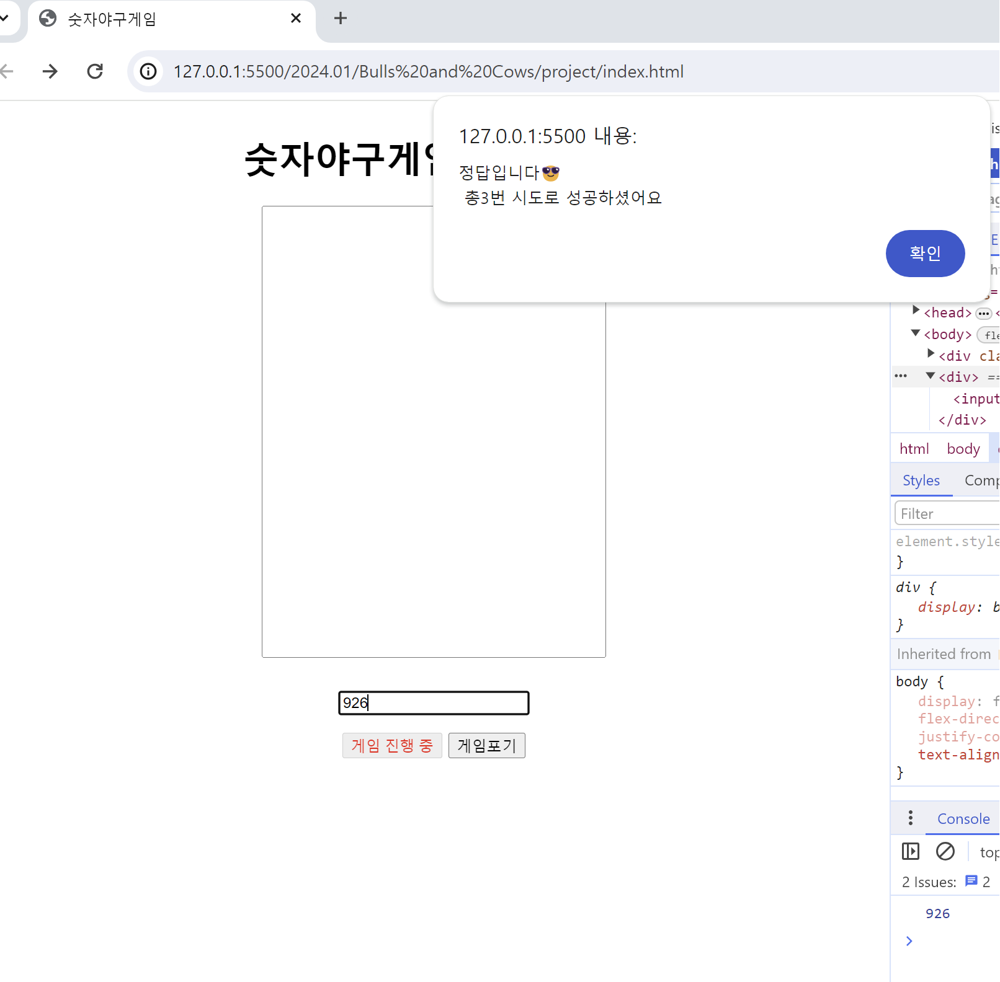

<h1>숫자야구게임 Project</h1>

본 프로젝트는 Javascript 언어를 이해하고, 활용하며 스스로 학습을 하는 데에 중점을 두고 진행하였습니다.
> 프로젝트 목표🔥  
처음 접하는 사람을 위해 게임을 소개하는 페이지를 제작하고, 누구나 '숫자야구게임'을 즐길 수 있도록 게임 동작을 구현해보는 것.
---

<h2>2024.01.02(1차 제작)</h2>

1.**단순한 CSS 적용** 
2.게임시작 버튼 클릭 시, **랜덤 세 자리 수 생성** / 포기 버튼 클릭 시 **정답 공개 후 종료** 
3.**게임시작 버튼 클릭 시**, 더이상 게임 시작 버튼 못누르게 하고, value값 '게임중'으로 변경(disabled 속성) **게임포기 버튼 클릭 시**, hint_text 초기화 

4.**checkMatch** 메소드 구현 

    (1)answer과 비교 기능 (toString 이용)

    (2)오답 시에 결과 출력 (ex: 1Ball , 1Strike ...)

    (3)정답이라면 정답입니다 뜨면서 게임 종료 & 기본 세팅값 init 함수를 통해 구현 

5.**display_result** 메소드 구현 (정답 틀렸을 경우)

    (1)🟡🟢🔴 판단해서 hint_text에 출력해준다.

<strong>2024.01.02</strong> 
입력값과 정답을 비교해서 strike,ball,out을 판단하는 과정에서 마무리
