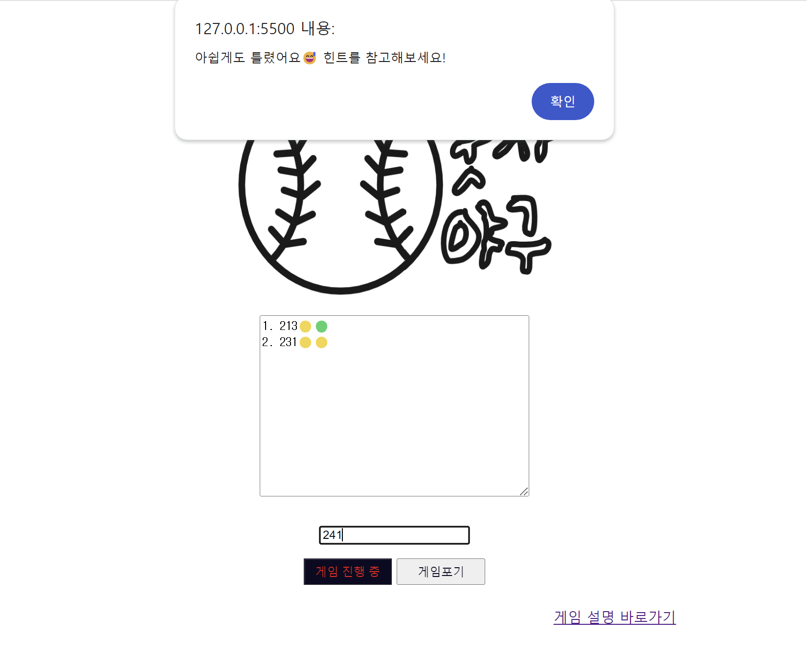

<h1>2024.01.03(Final)</h1>

> <strong>구현내용🟢</strong>
>  (1)**Strike, Ball, Out**을 판단하는 Algorithm 설계 
(2)**세 자릿수 숫자**보다 작거나 큰 숫자 입력 시 예외처리 
(3)**input text**타입에서 **textarea** 결과창을 변경 
(4)**CSS** 속성 수정 
(5)게임 초보자를 위한 **Intro** 작성   
<strong>추가예정🔴</strong> 
난이도 조정 기능(**시도횟수 제한**or**자릿수**) **Hint기능**(한자리씩 공개해줌)

<strong>알게된 점</strong> 

1.**배열 초기화**  
기초적인 문법사항이지만, 대괄호인지 중괄호인지 헷갈렸다. 

**let number_array = []** //배열 초기화 
**let number_array = [2, 3, 4]** //배열 선언 및 원소 추가 
**number_array.push(1)** //배열 원소 추가(push메서드 사용)
  
2. **input 요소의 형태인 text**와 **textarea**의 차이
<code>
<textarea class="hint_text" rows="4" cols="5" wrap="hard"></textarea>
<input type="text" class="input_text"/>
</code>

input type="text"는 **단일 행 입력창**이다.
여러 행을 입력하려면 **textarea**를 사용해야함.  
---

<h2>🟡소감 및 앞으로 배워나가야 할 점🟡</h2>

프로젝트를 제작하면서 느낀 점은 알고리즘이 상당히 단순함에도 불구하고, 내 코드는 **정돈되지 않고 지저분한 느낌**을 많이 받았다. 
그래서, 코드 가독성과 유지보수를 위해 중복된 코드를 **함수를 만들어서 사용**하고, 조금 더 효율적인 코딩이 가능하다면 **다른 코드를 생각해보는 능력**이 중요하다는 생각이 들었다.

또한, **CSS** 영역에서 아직 내가 많이 미숙하다는 생각을 했다. 어떤 요소의 위치를 조금 수정하려고 해도 2~3번 코드를 왔다갔다 했다. 
웹 페이지에서는 시각적인 요소가 상당히 중요하다는 생각을 가지고 있고, 그에 맞게 나 또한 CSS를 간과해서는 안될 것 같다.

