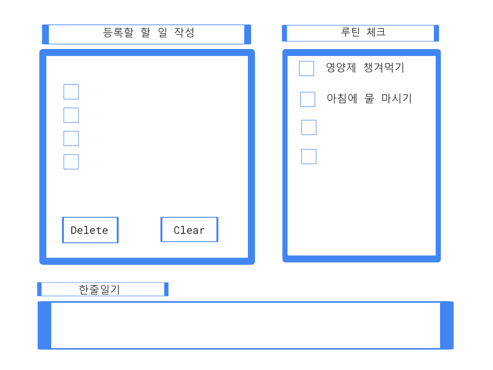
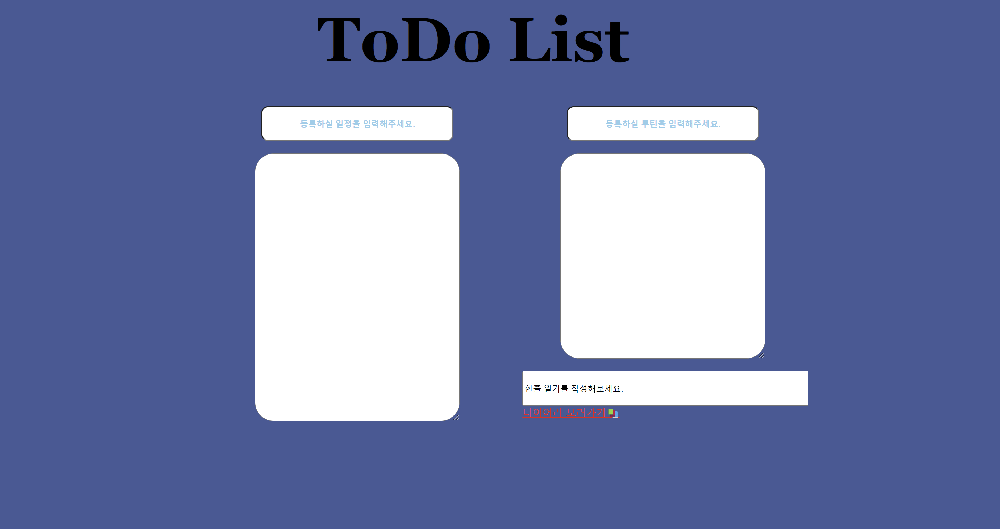

<h1>2024.01.11(목)</h1>

이번 프로젝트 주제는 **To Do List** 입니다.  

**프로젝트 목표🔥** 
* To Do List의 핵심적인 기능과 깔끔하고 단순한 UI를 구현하는 것.
* HTML,CSS,JavaScript 역량 증가 

---

<h2>Design✍️</h2>

**🟡Function**  
* 할 일 작성 
: 체크리스트 형태로, 수행 완료(✅)하면 취소선 생김, 다음 날이 되면 자동으로 초기화된다.

* 루틴 체크 
: 한번 지정해놓은 루틴은 다음 날이 되어도 초기화되지 않고 유지된다.

* 한줄 일기 
: 한 줄 일기를 저장하는 공간을 따로 만들어서 매 주 혹은 매 달마다 회고 할 수 있다. (Life Tracking) 

* 추가 예정...

**🟢User Interface** 

* 설계도

---

<h2>개발 일지💻</h2>

* 기본적인 UI를 구현하기 위해서 CSS파일을 작성함. 
**border**
**textarea**
**position**
**flex**  
생각보다 Component 위치 이동시키는 것이 상당히 까다로웠다.
아직 CSS 사용에 많이 미숙하다는 것을 느낀다.

