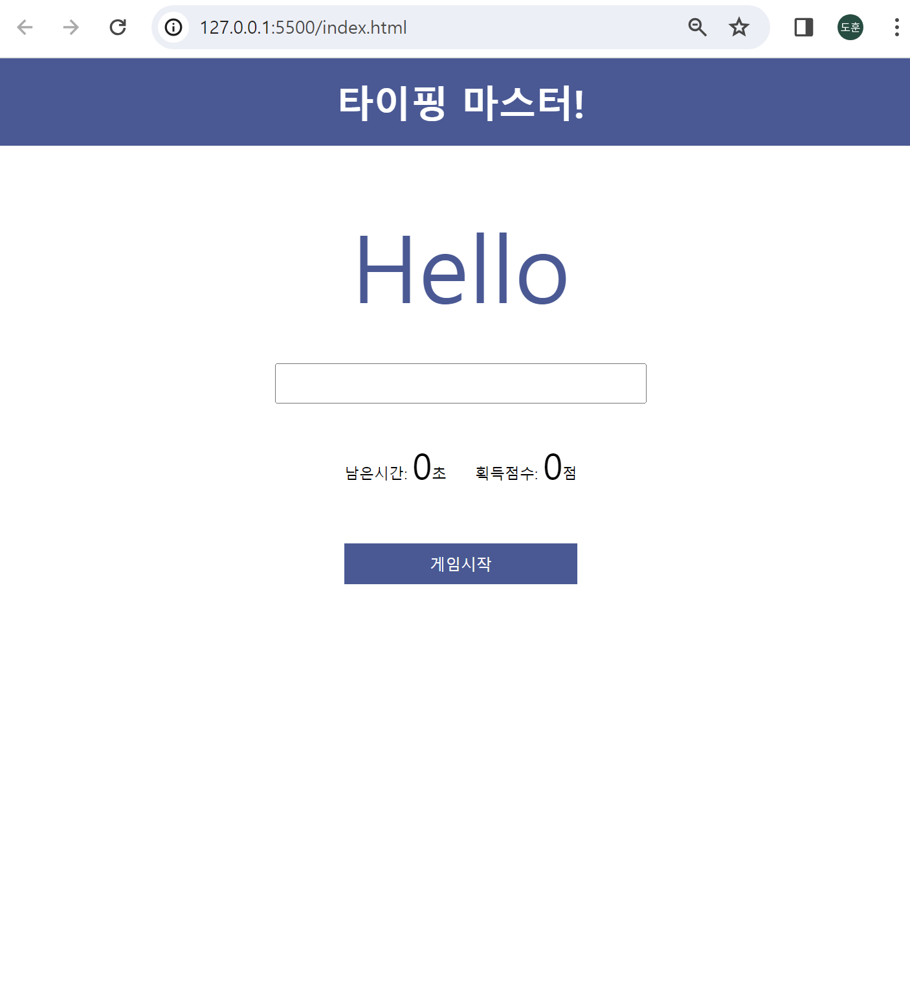
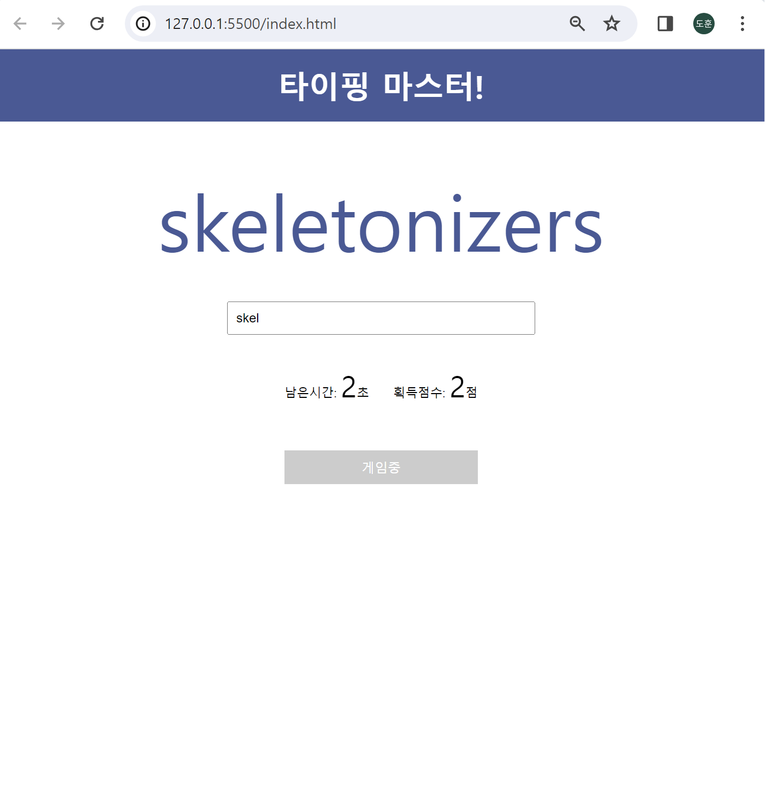

# Typing Game⌨️

<strong>학습 목표🔥</strong> 

* HTML,CSS,Javascript 문법에 적응하고, 활용하는 것

* 미니 프로젝트를 통해 코드, 파일 
정리 능력 향상

* 구현 중 발생하는 문제에 대해서 검색하고, 해결하는 능력 향상

---
<strong>What I Learned✍️</strong> 

>각 태그마다 **class명을 지어주는 것**이 중요하다.

클래스는 특정 그룹이나 유형의 요소에 스타일을 적용하거나 JavaScript와 같은 스크립트에서 해당 요소를 선택하는 데 사용된다.
<code>
 .header { //header라는 클래스명 가진 태그 속성 
    font-size: 18px; 
    font-weight: bold; 
    color: #333; 
    /* 기타 스타일 속성들 */  
}
</code>

>HTML파일에서 CSS,JS 파일을 적용시키려면?

**css파일 적용** <link rel="stylesheet" href="css/style.css(파일명예시)"\>  
**js파일 적용** <script src = "js/main.js(파일명 예시)"\> <\script\>

> <strong>CSS 알게된 것들</strong>

* display **flex**속성 (display:flex) 
flex는 레이아웃을 쉽게 지정할 수 있는 방법임. 
(1) **flex-direction**는 Flex-Item의 배치 방향 기본값은 row이고 **row-reverse, column, column-reverse** 등이 있음. 
(2)**flex-wrap**은 페이지에서 창을 확대했을 때 만약 **wrap**으로 설정되어있으면 확대 아무리해도 크기는 안변하지만 줄바꿈이 되고, **nowrap**(기본값)은 사이즈가 변화되어도 줄바꿈은 절대X  
(3)**justify-content** 속성은 정렬을 도와준다. **justify-content:center 는 가운데 정렬**
기본값은 **flex-start(왼쪽부터 시작)** **space-between는 양 옆으로 붙는다**(해당 태그의 width를 지정해줘야함)

* **padding=1rem**의 의미?  
해당 속성을 가진 요소의 모든 네 방향(위, 오른쪽, 아래, 왼쪽)에 대해 1루트 엘리먼트의 글꼴 크기와 동일한 여백을 부여
만약,  margin-top: 3rem;이라고 하면 글꼴 크기의 3배 만큼의 크기를 상단 여백으로 지정

><strong>Javascript 알게된 점</strong>

* **이벤트** 등록 및 처리 
* **화살표 함수(Arrow Function)** 작성 방법
* **let**과 **const**을 언제 사용하고, 왜 사용해야하는지에 대한 이해
* **innerHTML**과 **innerText**의 차이
* **setInterval**(countDown,1000)은 1초마다 countDown메서드(정의한 메서드)를 실행
* **classList.add**('클래스명')가 의미하는 것

* **HTML파일**에서의 이벤트 등록 방법과 **JS파일**에서의 이벤트 등록 방법

---

>프로젝트 중 문제 해결

* **게임시작 버튼을 누르고, 단어를 따라 써도 inputText 초기화 안되고, score 증가도 작동X**
-> checkstatus 메서드 안에 checkMatch 메서드 함수를 넣음으로써 해결

* **정답을 맞춰도 다음 word로 안넘어감**
-> run메서드 안에 getWords메서드를 넣음으로써 해결

<strong> 천천히 동작 과정을 살피면서, 어떤 순서에서 문제가 발생했는지 인과관계를 파악하여 수정하니 정상적으로 동작하게 만들 수 있었다. </strong>

---

* 시작화면

* 진행화면

 

<a href="https://velog.io/@dovelop/series/WEB">개인 블로그</a>에서 더 자세하게 알아보기
