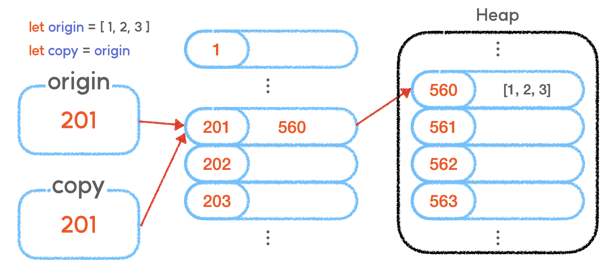
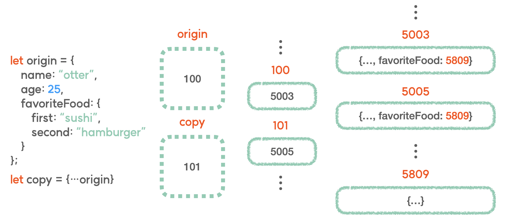

<h1>구조분해할당</h1>

구조화되어있는 배열이나 객체와 같은 **데이터를 분해(destructuring)시켜서, 각각의 변수에 담는 것**

⭐**배열** 
~~~javascript
let arr = [1,2,3];
let [a,b,c] = arr;
~~~
a 변수에는 1 b변수에는 2 c변수에는 3이 할당된다.

---

⭐**객체** 
~~~javascript
const person = {
    name:"dohun",
    age: 24,
    address: "Incheon"
};

let {name, age} = person; //name : 'dohun' , age:24
let {name:새로운 변수명, age:새로운 변수명} = person;

let {name:newName, age:newAge} = person; 
//newName = 'dohun', newAge = 24
~~~

객체의 구조분해할당에서는 **중괄호와 프로퍼티의 Key값을 작성**한다.

<h1>spread 연산자(...)</h1>

하나로 뭉쳐있는 값들의 **집합을 전개해주는 연산자**

~~~javascript
let arr = [1,2,3,4,5]
console.log(arr); // [1,2,3,4,5]
console.log(...arr); // 1,2,3,4,5 

//문자열에 사용하면, 각 문자별로 분할함.

let str = "Hello"
console.log(...str); //H e l l o 
~~~

그렇다면 **객체는**?
~~~javascript
const person = {
    name:"dohun",
    age: 24,
    address: "Incheon"
};

const copyObj = ...person //에러!!
const copyObj = {...person} //새로운 객체를 생성 후 할당
~~~

위에서는 copyObj와 person 객체가 서로 영향을 주고받지 않는다.

그렇다면, 아래와 같이 중첩객체에서는 어떨까?

~~~javascript
const obj = {
	name: "otter",
	gender: "male",
  favoriteFood: {
		first: "sushi",
		second: "hamburger"
  }
}

const newObj = { ...obj }
~~~

~~~javascript
obj.name = "rabbit"
obj.gender = "female"
obj.favoriteFood.first = "cold noodle"

console.log(newObj)

/*
	{
		name: "otter",
		gender: "male",
	  favoriteFood: {
			first: "cold noodle",
			second: "hamburger"
	  }
	}
*/
~~~

위처럼, 중첩객체를 가지고 있는 경우에
객체 안의 객체는 서로 공유한다.(참조주소가 동일) 
이는 **스프레드 연산자를 사용해서 해준 복사가 얕은 복사이기 때문**이다.

우리가 아는 **참조 타입의 데이터**는 **heap**이라는 임시 저장 메모리에 담기게 됩니다.

그리고 이 heap이라는 영역은 **참조 타입 데이터와 같이 그 데이터의 크기가 유동적으로 변할 수 있다는 특징**을 가지고 있습니다.

그리고 우리가 **중첩 객체를 스프레드 연산자로 복사했을 때의 문제점**도 이 개념에서 찾아볼 수 있다.

스프레드 연산자를 사용해서 객체의 중괄호를 한번 벗겨냈을 때, **다른 property들은 모두 주소값의 연결이 끊어진채로 새로운 주소를 가진 데이터로 완전히 복사**가 되었지만, 이때도 그 **내부에 존재하는 favoriteFood 객체는 펼쳐지지 못한 것이다**

그래서 원**본 객체의 favoriteFood와 복사된 객체의 favoriteFood는 여전히 같은 주소값을 공유**하고 있었던 것이다.  

우리는 이러한 문제를 해결하기위해서 JSON.stringify()와 JSON.parse()를 사용할 수 있다.

~~~javascript
const obj = {
	name: "otter",
	gender: "male",
  favoriteFood: {
		first: "sushi",
		second: "hamburger"
  }
}

const copy = JSON.stringify(obj)

console.log(copy)
// {"name":"otter","gender":"male","favoriteFood":{"first":"sushi","second":"hamburger"}}
~~~

JSON.stringify()는 소괄호 안에 들어가는 값을 JSON 데이터 포맷, 즉 문자열로 변환해준다.

위의 예시처럼 문자열로 변환이 된다면, **copy에 담긴 값은 더이상 객체가 아니며 완전히 새로운 문자열**이기 때문에 **전혀 새로운 주소값**을 가지게 됩니다.

~~~javascript
const deepCopy = JSON.parse(copy)

console.log(deepCopy)

/*
	{
		name: "otter",
		gender: "male",
	  favoriteFood: {
			first: "sushi",
			second: "hamburger"
	  }
	}
*/
~~~
이후, **JSON.parse()**를 사용해서 **JSON 데이터 포맷을 다시 객체 형태로** 바꿔주면,

이때 **새로운 객체가 생성되며 deepCopy에 담기는 것이기 때문에 원본 객체와는 전혀 다른 주소값을 가진 객체가 생성되는 것**이다.

이러한 복사를 **깊은 복사**라 부른다.