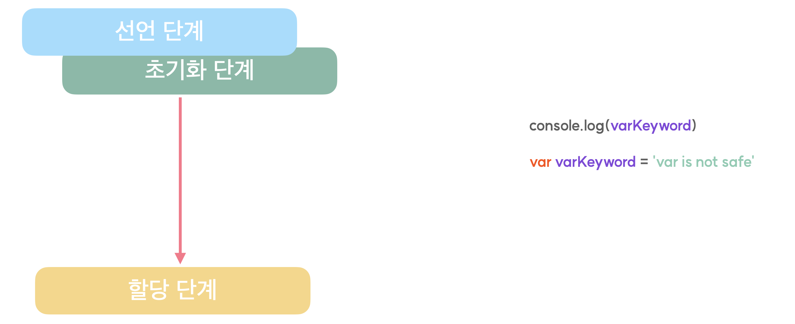

<h1>Scope, Hoisting</h1>

**지역 레벨 스코프** (함수레벨스코프, 블록레벨 스코프) 

**var**키워드는 **global 변수에 속하게 된다.**   즉, 블록레벨 스코프를 따르지 않는다.(조건문,반복문) 

다른 사전에 선언된 전역 변수를 덮어쓰기(재할당) 할 수가 있음. -> var키워드의 위험성

>**스코프 체이닝** 
자바스크립트는 변수를 참조하는 코드를 만나게 됐을 때, **먼저 해당하는 블록 스코프 내에서 변수를 참조하고자 시도**하는데 이때 탐색한 블록 스코프 내에 해당 변수가 존재하지 않는 경우, **상위 스코프로 올라가 다시 탐색을 진행**하게 되는데 이것을 **스코프 체이닝**이라고 부른다.
---
<h1>classList</h1>

**newLi.classList.toggle('complete')**  
토글이기때문에 onclick 이벤트 리스너 처리 과정에서 추가ㆍ삭제 반복 가능

~~~javascript
li button:active {
    border: 2px solid gray
}
~~~
**active는 활성화 될 때 속성을 설정할 수 있다.**

~~~javascript
const liList = document.querySelector('li');
//liList 삭제
liList.remove();
~~~

**remove를 활용한 HTML 요소 삭제**

**document.querySelectorAll('태그명');** 
해당하는 태그를 모두 가져온다.

---

~~~javascript
todoList.children[i].classList.contains('complete')
~~~
**classList.contains('complete')** 
해당 태그에 complete라는 클래스가 포함되어있는가를 체크한다.

todoList.**children**을 하면 li태그들이 모두 보인다. 
children은 **배열형으로 반환하기 때문에 인덱스로 접근 가능**

todoList.children[0] : 첫번째 li태그

todoList.children[0].querySelector('span').textContent;

첫번째 li태그에 있는 span태그의 텍스트를 가져온다.

---

**localStorage**에는 **문자열 데이터만 저장**해줄 수 있다. 
**객체나 배열을 문자열로 변환해주는** 문자 텍스트형 **JSON 데이터 포맷**이 있음.

---

<h1>호이스팅(hoisting)</h1>

**let키워드는 선언 이전에 호출 시에 에러를 던지고, 코드 실행이 중단**됨. 
반면에, **var키워드는 선언 이전에 호출하면 defined를 반환하고 그 상태로 코드가 계속 실행**됨 

🔴이유  
var키워드 같은 경우는 자바스크립트에서 해석을 할 때
~~~javascript
console.log(a);
var a = "123";
//위 코드를 아래와 같이 해석한다.
var a;
console.log(a);
a = 123;
~~~ 

실제 동작 과정에서 선언부가 올라가는 것은 아님!

~~~javascript
fn1()
function fn1() {
...
} 
//위 함수가 아래처럼 인식
function fn1() {
...
}
fn1()
//호이스팅 발생

fn2()
const fn2=function() {
...
} //fn2 함수 인식 아예X
~~~

**표현식**으로 작성 시, 에러발생(호이스팅 발생X) 
**선언식**으로 작성 시, 에러발생 X(호이스팅 발생) 

>호이스팅(hoisting)이란? 
코드가 실행하기 전 **변수선언/함수선언 이 해당 스코프의 최상단으로 끌어 올려진 것 같은 현상**

그러면 let, const는 호이스팅 발생X, var는 호이스팅 발생O 인건가? **NO!!**  

let과 const는 선언 단계와 초기화 단계가 분리되어 실행되는데, 그 사이에는 TDZ가 존재함.

**var키워드는 선언단계와 초기화단계를 같이 진행**하기 때문에 데이터는 없고 메모리가 할당된 상태가 된다.

---

<h1>localStorage & API</h1>

 **if (storageData?.complete)** 

**storageData가 실제로 존재 할 때만 complete를 찾고, 없을 때는 찾지 않는다.** 
따라서, storageData가 없을 때는 시도 조차 안하기 때문에 오류가 뜨지 않는다. 
즉, **if (storageData && storageData.complete)** 와 **같은 의미**이다.

---

>**API란 무엇인가?** 
어떠한 프로그램에서 제공하는 기능을 사용자가 활용할 수 있도록 만들어 둔 인터페이스
**사용자의 요청을 듣고**, 서버에게 요청한 **데이터를 받아와서 사용자에게 전달**해주는 역할을 한다.

Geolocation API : 사용자의 현재위치를 가져오는 API

---

**URL의 구조** 

https
 **(프로토콜)**:
 //api.openweathermap.org
(도메인)/
data/3.0/onecall
(포트)
?lat={lat}&lon={lon}&exclude={part}&appid={API key}
(매개변수)

---

**HTTP** 
서버와 클라이언트가 통신하기 위해 정의된 규약

> ❗️**HTTP Request Method** 
HTTP 요청은 각 요청마다 Method를 사용하며 그 역할이 모두 다름.
> API메소드
> - **GET** : 서버의 데이터를 조회하는 Method ( HTTP message에 요청 바디를 담아줄 수 없다. )
> - **POST** : 서버에 데이터를 등록하는 Method
> - **PUT**: 서버의 리소스를 Request body에 담긴 내용으로 수정하는 Method
> - **PATCH** : 서버 내 리소스의 일부를 수정하는 Method
> - **DELETE**: 서버 내 리소스를 삭제하는 Method
> -**OPTION** : 서버에서 허용하는 Method의 목록을 알려주는 Method

---

**Call Stack**
함수의 실행순서가 담겨지는 공간

**Callback queue** 
Call Stack에 있는 함수들이 완전히 비워지면 그때 **Callback queue에 있던 콜백함수가 들어가서 실행된다**.

**Promise 객체** 

**서버와의 통신**은 자바스크립트가 코드를 실행하는 것보다 **느릴 수 밖에 없다.** 

그래서, 우리 아직 서버와 통신을 완료하지 못해서 응답을 받지못했지만 언젠가는 응답을 돌려주겠다는 의미

**3가지의 상태** 
- **대기(Pending)** 비동기 처리가 아직 완료되지 않은 상태
- **완료(Fulfilled)** 비동기 처리가 완료되어 결과값을 반환해준 상태
- **실패(Rejected)**  비동기 처리가 실패 혹은 오류가 발생한 상태

**then** 
promise가 **fulfilled가 될 때까지 기다림**, **fulfilled가 되면 then이 실행이 됨.**

**parse와 json() 차이점** 

JSON.parse()은 **주어진 문자열을 직접 파싱하여 JavaScript 객체로 변환하는 데 사용**되고, response.json()은 **fetch()로 받은 HTTP 응답에서 JSON 데이터를 파싱하여 JavaScript 객체로 변환하는 데 사용**