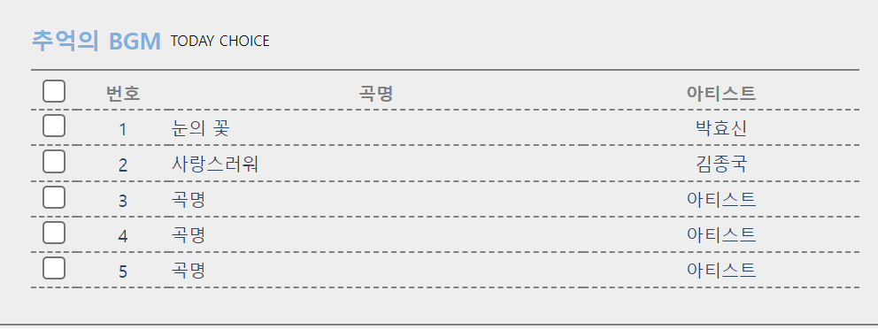
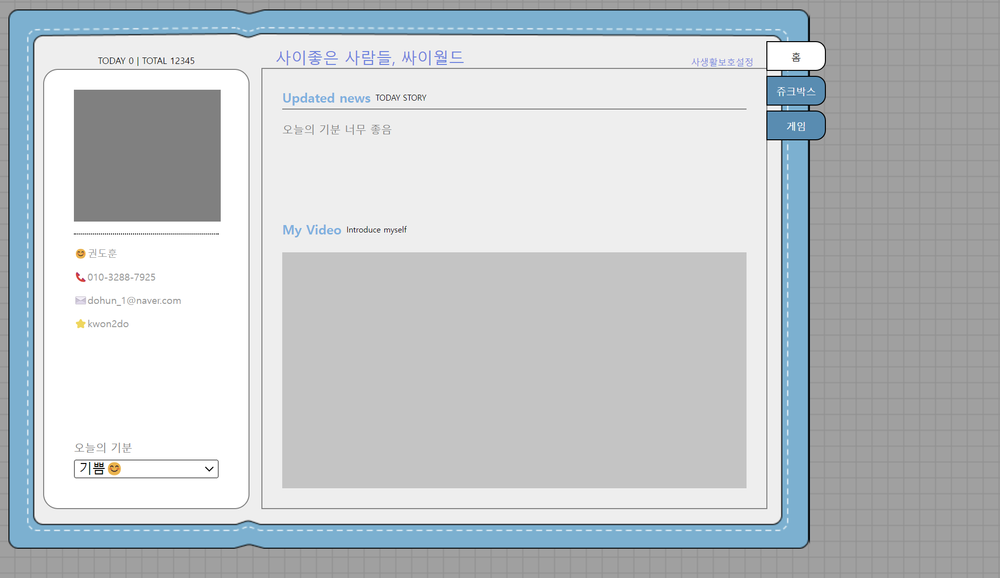
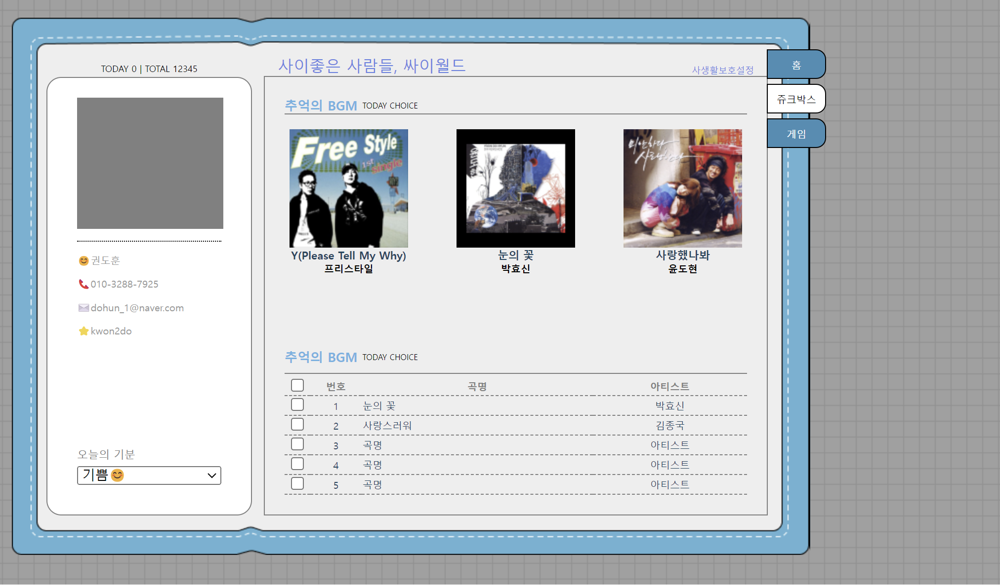
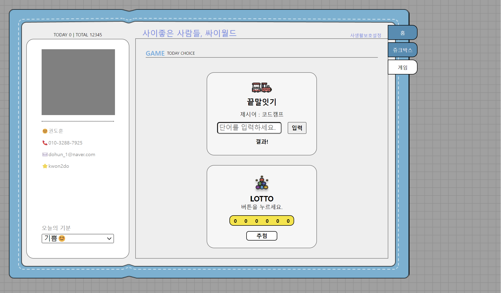

<h1>2024.01.20(토)</h1>

* **html Table 사용**

* **알게된 점**

<h2>html Table 사용</h2>

~~~html
<table class="albumTable">
    <tr>
        <th class="albumTable__checkbox"><input type="checkbox"></th>
        <th class="albumTable__number">번호</th>
        <th class="albumTable__song">곡명</th>
        <th class="albumTable__artist">아티스트</th>
    </tr>
    <tr>
        <td class="album-table-checkbox"><input type="checkbox"></td>
        <td class="album-table-number">1</td>
        <td class="album-table-song">눈의 꽃</td>
        <td class="album-table-artist">박효신</td>
    </tr>
                ...
</table>
~~~

표의 모든 줄은 **tr(table row)** 태그 사용 

제목은 **th(table header)** 태그 사용 

내용은 **td(table data)** 태그 사용 

<u>**.albumTable th**</u> 
=> albumTable클래스 안에 있는 **th 태그 모두 선택** 하는 방법

**border-spacing** : 표에서 카테고리마다 분리된 선의 공백이 채워짐.

line-height: 글씨가 써져있는 높이를 조절하는 것

---

<h2>알게된 점</h2>

**이벤트 변경 감지** 

**oninput**  
=> 텍스트가 변경될 때 마다 호출

**if(email !== "")와 if(email)** 은 같은 뜻이다. 
기본적으로, **값이 들어있으면 true 없으면 false로 인식**한다.  

html input태그 속성으로 **maxlength** 사용하면 **최대 입력 길이 조절** 가능함.

**border-radius: 0px 10px 10px 0px** 
boder 마찬가지로 시계방향으로 조정가능

**cursor:pointer** 
마우스 커서 갖다댔을 때 **클릭할 수 있는 것처럼** 보이게

**setAttribute("바꿀속성","바꿀내용")**  
태그 안에 있는 속성을 바꿔줄 수 있다.

---

