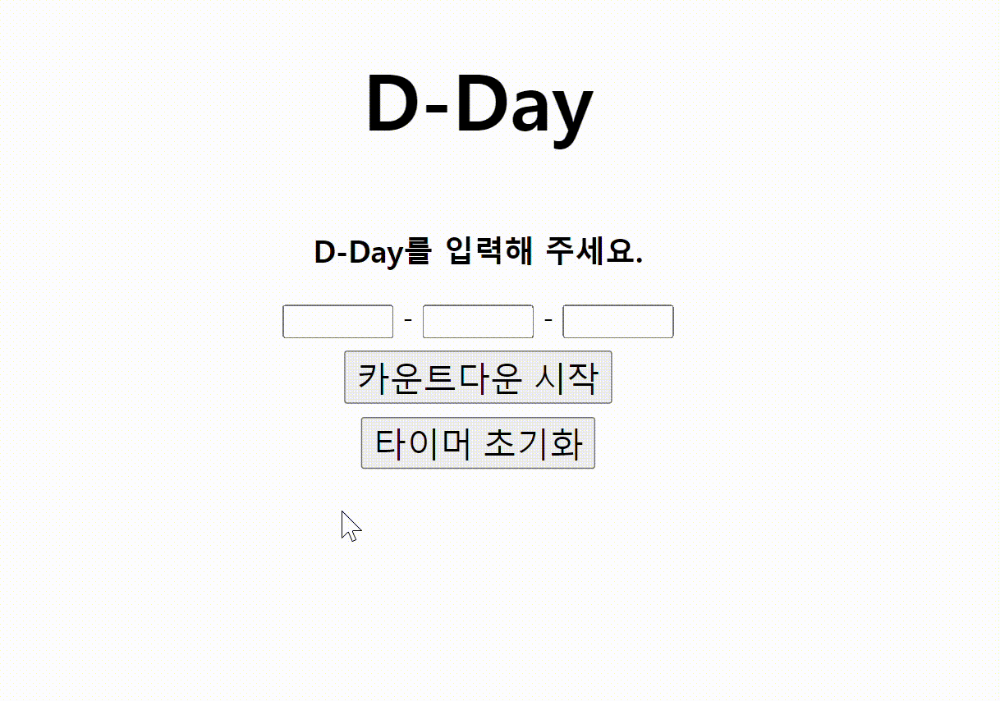

<h1>D-day Counter</h1>

<h2>프로젝트 소개</h2>
D-day 계산기 프로젝트는 사용자에게 날짜를 입력받아 현재로부터 해당 날짜까지의 일수를 계산해주는 간편하면서도 실용적인 도구를 제공합니다.

<h2>프로젝트 동기</h2>

* D-day 계산기는 사용자가 중요한 날짜에 대한 일수를 빠르게 확인하여 일정을 미리 준비하고 관리하는 데 도움을 줍니다.

* 사용자 친화적인 인터페이스를 통해 누구나 쉽게 날짜를 입력하고 D-day를 계산할 수 있도록 디자인되었습니다. 

<h2>구현 기능</h2>

* **카운트다운 시작 버튼**을 누르면 사용자가 입력한 날짜까지 얼마나 남았는지 계산해줌.

* **과거 날짜 입력 시,** '타이머가 종료되었습니다.' 문구 출력

* **잘못된 날짜를 입력 시,**  '유효한 시간대가 아닙니다.' 문구 출력

* **'타이머 초기화'버튼**을 통해 이미 동작하고 있는 타이머를 초기화시킬 수 있음.

* **localStorage 기술을 사용**해서 웹 브라우저 닫기 또는 새로고침 상황에서 타이머가 초기화되는 문제 방지

<h2>배운 점 & 아쉬운 점</h2>

**배운 점**

- Date 객체 생성 시에, 인자로 어떤 Format이 들어갈 수 있는 지 알게 됨.

- localStorage에 데이터를 저장하는 법, 그리고 저장된 데이터를 불러오는 법을 알게 됨.

- JavaScript에서 각 태그의 style 속성에 접근하여 display 값을 변경할 수 있게 됨.

- 다중 버튼 클릭으로 인해 발생된 Interval을 처리하는 법을 알게 됨.(clearInterval함수 구현)

**아쉬운 점**

타이머가 종료되면 알람 소리가 자동 실행되도록 구현하고 싶었는데 구현하지 못했다.