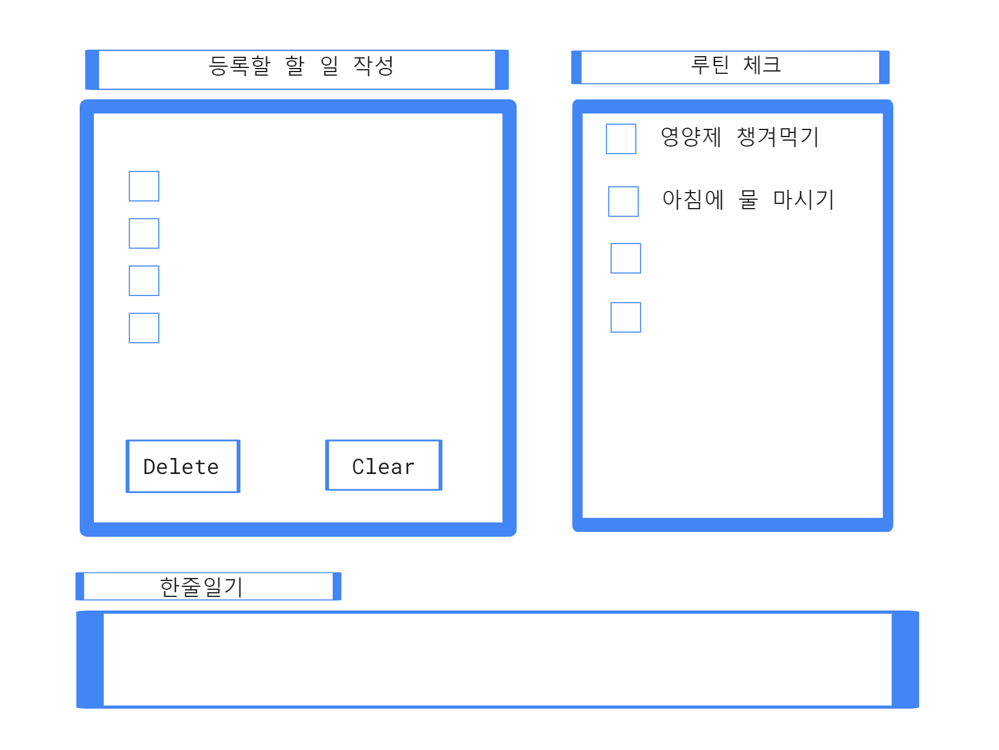

<h1>2024.01.11(목)</h1>

이번 프로젝트 주제는 **To Do List** 입니다.  

**프로젝트 목표🔥** 
* To Do List의 핵심적인 기능과 깔끔하고 단순한 UI를 구현하는 것.
* HTML,CSS,JavaScript 역량 증가 

---

<h2>Design✍️</h2>

**🟡Function**  
* 할 일 작성 
: 체크리스트 형태로, 수행 완료(✅)하면 취소선 생김, 다음 날이 되면 자동으로 초기화된다.

* 루틴 체크 
: 한번 지정해놓은 루틴은 다음 날이 되어도 초기화되지 않고 유지된다.

* 한줄 일기 
: 한 줄 일기를 저장하는 공간을 따로 만들어서 매 주 혹은 매 달마다 회고 할 수 있다. (Life Tracking) 

* 추가 예정...

**🟢User Interface** 

* 설계도

---

<h2>개발 일지💻</h2>

* 기본적인 UI를 구현하기 위해서 CSS파일을 작성함. 
**border**
**textarea**
**position**
**flex**  
생각보다 Component 위치 이동시키는 것이 상당히 까다로웠다.
아직 CSS 사용에 많이 미숙하다는 것을 느낀다.

---
<h1>2024.01.12(금)-구현 완료</h1>

---
<h2> 구현 기능💡 </h2>

* 웹 페이지가 Load될 때, 기본적으로 To-do 입력창에 **focus 설정**했고, **setTimeout 메서드**를 사용해서 1초 뒤 설명text를 지워줍니다.

* 사용자가 To-do 입력창에 할 일을 작성 후 **Enter키를 누르면 아래에 있는 To-do List에 순차적으로 열거되도록** 구현.

* **태그(#,@) 인식 기능**을 구현
**#태그**: **카테고리 분류 기능** 
할 일을 작성한 후 '#카테고리명'을 붙이면 이에 상응하는 이모티콘이 함께 List에 등록되어서 구분할 수 있습니다.
Ex)책 반납하기#일상 -> 🔅️책 반납하기
**(운동🏋️‍♀,학업✏️,건강❤️,구매💰,일상🔅️)**
 **@태그**: **일정 완료처리 기능**
**완료된 일정에 체크 표시(✅)로 확인** 할 수 있습니다.
Ex)1@ -> 첫 번째 할 일✅
* **Routine 관리 기능**
**To-do 관리와 로직은 동일하고, 독서📚건강❤️취미🔅로 분류됩니다.**
루틴으로 설정한 항목은 다음 날이 되어도 초기화되지 않고, 완료 표시만 초기화 됩니다.(아이디어 처리)

* **한줄 일기 기능**
**하루를 돌아보는 한 줄 일기를 작성할 수 있고, 작성을 완료하면 일기가 성공적으로 저장됐다는 메시지가 출력**됩니다. 또한, '다이어리 보러가기' 링크를 클릭하면, 그동안 저장된 한줄 일기를 모아볼 수 있습니다.(아이디어 처리)

* **To-do List 사용 안내 TEXT**
처음 사용하는 유저를 위해서 **To-do List 사용법**을 작성했습니다.
---

<h2>문제해결</h2>

**할일 완료 시에 해당 to do 완료 표시 구현하는 과정**에서, 두 가지 아이디어가 처음에 떠올랐다.

* '\n'기준으로 todo배열(split사용)을 만들어서 입력한 인덱스에 있는 할 일을 찾은 뒤 todo_list에서 **제거**한다.(체크가 아니라 아예 삭제하는 방법)
:삭제를 하면 무엇을 했는지 파악하기 힘들어서 PASS

* todo_list 업데이트 함수 구현 -> todo배열(todo_list에 있는 각 할 일들이 차례대로 저장되어있음)을 활용해서, 입력한 인덱스(1부터)에 있는 할 일에 ✅추가.
:이 방법을 선택했지만, 처음에는 todo_input(입력창 값)을 todo배열에 저장하니까 **카테고리(이모티콘)는 제외되고 저장이 되는 문제가 발생**했다.
그래서, todo_list값을 가져오기에는 계속 누적되는 오류가 발생하기 때문에
한 개의 항목을 추가할 때마다 todo배열에 todo_list값을 넣어주고(todo_index 사용) 초기화 그리고 update를 하는 방식으로 구현했다.
~~~javascript
function update() {
    todo_list.value = ""; //누적 방지
    for(var i=0; i<todo.length; i++) { //todo_list 업데이트
        todo_list.value += todo[i]+"\n";
    }
    routine_list.value = ""; //routine_list 업데이트
    for(var i=0; i<routine.length; i++) {
        routine_list.value += routine[i]+"\n";
    }
}
var tmp = todo_list.value; //현재 todo_list.value 저장
todo[todo_index] = tmp; //save
todo_index++;
update();
~~~

<h2>개선해야될 부분🔥</h2>

* JQuery와 같은 라이브러리 활용
* CSS 보충 학습 필요
---