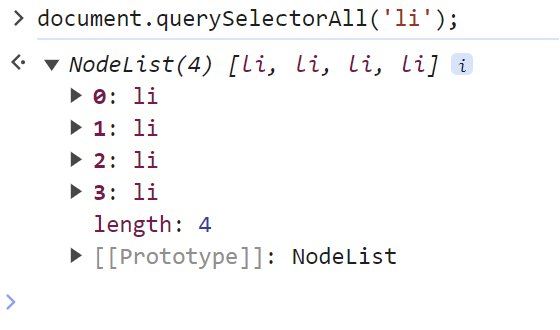

<h1>ToDoList with Weather⛅</h1>

<h2>프로젝트 소개</h2>

**ToDoList with Weather**는 **간단한 할 일 목록을 관리하는 동시에 사용자의 현재 위치와 날씨 정보를 통합하여 제공**하는 프로젝트입니다. 
기본적인 ToDoList의 기능뿐만 아니라 날씨 정보를 활용하여 사용자에게 더 많은 가치를 제공할 수 있습니다.

<h2>프로젝트 동기</h2>

간단한 ToDoList에 머문 것이 아니라 **날씨 정보와의 결합을 통해 사용자에게 더 많은 가치를 제공할 수 있을 것이라고 생각**했습니다.

<h2>구현 기능</h2>

<h3>📃ToDoList 기능</h3>

* 할 일 입력 후 Enter 키 입력 시, **할 일 항목이 실시간으로 추가**됩니다. 

* **완료된 할 일은 취소선과 회색 글씨로 표시**되어 완료 여부를 시각적으로 확인할 수 있습니다. 

* 할 일 항목에 더블 클릭 시, **해당 항목이 완전히 삭제**됩니다. 

* 전체 삭제 버튼 클릭 시, **작성한 모든 할 일 항목이 삭제**됩니다. 

* 작성한 ToDoList는 **브라우저의 localStorage에 저장**되어 새로고침이나 재부팅 시에도 데이터가 유지됩니다. 

<h3>⛅날씨 통합 기능</h3>

* **사용자의 위치 정보**를 Geolocation API를 이용하여 가져옵니다.

* OpenWeatherMap API를 활용하여 **현재 위치의 날씨 정보를 실시간으로 획득**합니다.

* **날씨 데이터를 기반으로 배경 이미지가 변경**되고, **현재 지역명이 표시**됩니다.

<h3>💻JavaScript 개발 관련 기술</h3>

* **호이스팅(hoisting)** 개념을 학습하고 적용하였습니다.

* **API**의 개념을 이해하고, **Geolocation API**와 **OpenWeatherMap API**를 사용하여 데이터를 획득하였습니다.

* 데이터 구조를 유지하기 위해 객체를 활용하고, **중첩 객체의 경우 JSON 메서드를 사용**하여 데이터를 다루었습니다.

* 객체와 배열을 다루는 과정에서 **얕은(참조) 복사와 깊은 복사의 차이**를 이해하고 적용하였습니다.

<h2>코드 리뷰(알게된 점과 부족한 점)</h2>

<h3>알게된 점</h3>

* **JavaScript 내에서 HTML 태그를 생성/제거하는 방법** 
createElement 메서드 사용
~~~javaScript   
  //태그 생성
  const newLi = document.createElement('li');
  const newSpan = document.createElement('span');
  const newBtn = document.createElement('button');

  //태그 제거
  newLi.remove();
~~~

* **classList를 활용하여 toggle 기능 구현** 
~~~javaScript
//newLi라는 HTML 요소에 'complete'라는 클래스를 추가
newLi.classList.add('complete');
//버튼이 클릭될 때마다 'complete' 클래스의 상태를 토글(생성or제거)
newBtn.addEventListener('click', () => {
    newLi.classList.toggle('complete');
});
~~~

* **appendChild 메서드**  
새로운 자식 노드를 부모 노드의 가장 끝에 추가할 수 있다. 
가령, 새로운 항목을 뜻하는 **li태그(부모노드) 안에 button 요소와 span 요소(자식노드)를 추가하고 싶을 때** 아래와 같이 사용한다.
~~~javaScript
newLi.appendChild(newBtn);
newLi.appendChild(newSpan);
todoList.appendChild(newLi);
~~~

* **querySelectorAll 메서드** 
특정 CSS 선택자에 해당하는 **모든 요소를 NodeList(특수객체)형태로 반환** 
배열처럼 인덱스로 각 노드에 접근 가능하고, 각 li태그의 정보들이 담겨있다.

~~~javascript
for (let i = 0; i < liList.length; i++) {
    liList[i].remove();
  }
~~~

* **children 프로퍼티와 contains 메서드** 
아래 함수는 localStorage에 저장하기 위해 현재까지 등록된 todo 항목들을 저장하는 함수이다. 
todoList에는 각각의 todo 항목(li태그)들이 담겨져있다. 
여기서, 완료된 항목을 구분해서 저장해주지 않으면 localStorage도 완료 여부를 모른 채로 데이터를 내주게된다. 
따라서, 완료된 항목을 구분해주는 프로퍼티를 생성하여 따로 저장해준다.

~~~javascript
const saveItemsFn = function () {
  const saveItems = [];
  for (let i = 0; i < todoList.children.length; i++) {
    const todoObj = {
      contents: todoList.children[i].querySelector('span').textContent,
      
      complete: todoList.children[i].classList.contains('complete'),
      //complete클래스가 포함되어있는지 확인 -> 완료여부 체크
    };
    saveItems.push(todoObj);
  }
}
~~~
* **⭐API 사용 및 Promise 객체, 구조분해할당 활용⭐** 

accessToGeo 함수는 askForLocation가 fulfilled 상태일 때 호출되는 콜백함수로 사용된다. 
이때, accessTogeo에는 askForLocation 함수의 return값(위치정보)이 인자로 넘겨받게 됨. 
그런데, 구조분해할당을 이용해서 인자로 받은 곳에 접근해서 coords라는 객체로 사용하게 된 것이다. 
마찬가지로, positionObj객체를 weatherSearch 함수의 인자로 넘겨주고 호출한다. 

weatherSearch 함수에서도 마찬가지로 구조분해할당으로 positionObj의 프로퍼티에 바로 접근한다. 

또한, then은 앞서 실행한 비동기 메서드가 완료될 떄까지 기다렸다가 완료되면 완료된 메서드의 return값을 인자로 받아와서 호출된다.

~~~javaScript
const askForLocation = function () {
//사용자에게 위치 정보를 요청->성공적으로 얻은 경우 accessToGeo 함수 호출
  navigator.geolocation.getCurrentPosition(accessToGeo, (err) => {
    console.log(err);
  });
};

//구조분해할당 예제
//coords 객체를 인자로 활용함으로써 코드가 간략화 됨.
const accessToGeo = function ({ coords }) {
  const { latitude, longitude } = coords;
  // shorthand property
  const positionObj = {
    latitude,
    longitude,
  };

  weatherSearch(positionObj);
};

const weatherSearch = function ({ latitude, longitude }) {
  fetch(
    `https://api.openweathermap.org/data/2.5/weather?lat=${latitude}&lon=${longitude}&appid=02852817da564bf041afa7531f67f0b8`
  )
    .then((res) => {
      return res.json();
    })
    .then((json) => {
      const weatherData = {
        location: json.name,
        weather: json.weather[0].main,
      };
      weatherDataActive(weatherData);
    })
    .catch((err) => {
      console.log(err);
    });
};
~~~

* **JSON.parse() , JSON.stringify**

**JSON stringify , parse를 통해 객체의 깊은 복사가 가능하다.**
~~~javascript
const obj = {
	name: "otter",
	gender: "male",
  favoriteFood: {
		first: "sushi",
		second: "hamburger"
  }
}

const copy = JSON.stringify(obj)

console.log(copy)
// {"name":"otter","gender":"male","favoriteFood":{"first":"sushi","second":"hamburger"}}
~~~

위의 예시처럼 문자열로 변환이 된다면, **copy에 담긴 값은 더이상 객체가 아니며 완전히 새로운 문자열이기 때문에 전혀 새로운 주소값을 가지게 된다**.

~~~javascript
const deepCopy = JSON.parse(copy)

console.log(deepCopy)

/*
	{
		name: "otter",
		gender: "male",
	  favoriteFood: {
			first: "sushi",
			second: "hamburger"
	  }
	}
*/
~~~

이후, **JSON.parse()** 를 사용해서 **JSON 데이터 포맷을 다시 객체 형태로** 바꿔주면,

이때 **새로운 객체가 생성되며 deepCopy에 담기는 것이기 때문에 원본 객체와는 전혀 다른 주소값을 가진 객체가 생성**되는 것이다.

---