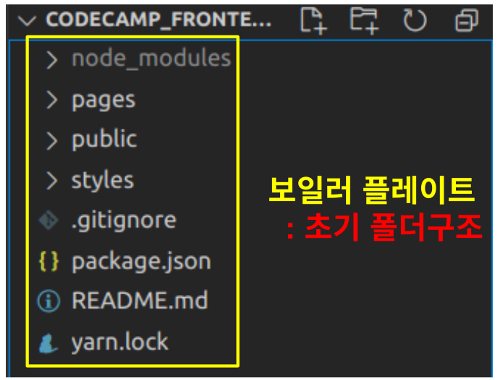

<h1>React 소개</h1>

`React는 javascript를 쉽고, 효율적으로 사용할 수 있도록 Facebook에서 만든 도구`이다.

 대표적인 서비스로는 `페이스북, 인스타그램, 에어비앤비`등이 있다.

---

[참고]

💡 `기본 리눅스 명령어` 
앞으로 개발을 하면서 자주 사용하게 될 기본 명령어들을 정리한 것. 
모든 명령어는 명령어 뒤에 **--help 옵션**을 작성하면 자세한 사용 방법을 알 수 있다.

---

<h1>Node.js , NPM , yarn</h1>

`Node.js` 
JavaScript를 **서버 사이드에서 실행할 수 있게 되었으며,** 주로 웹 서버를 만들고 비동기적인 이벤트 처리를 지원하는 데 사용됨.

`NPM`(Node.js설치 시 자동 설치) 
**Node.js 패키지 및 모듈을 관리하는 도구**
JavaScript 프로젝트에서 **코드 공유**,**라이브러리 설치** 등을 쉽게 할 수 있도록 도와줌.

`yarn` 
페이스북에서 개발하였고, **NPM과 역할은 동일**하지만  NPM의 일부 문제를 해결하고 **성능을 향상**시키기 위해 만들어짐.

위 그림처럼 `github와의 통신`에서는 **git push , git pull**이 사용되듯이, `NPM(npmjs.com)`에 코드 공유를 위해서 **npm publish**, 다운 받기위해 **npm install**를 사용하는 것이다.

`'yarn add 기능명'(=npm install)`
---

<h1>보일러 플레이트(Boiler Plate)</h1>

이렇게 `초기 셋팅이 완료된` 폴더를 `보일러플레이트`라고 한다.

보일러플레이트는 회사마다 다를 수 있다. 
예를들어서, 쇼핑몰을 만드는 회사면 쇼핑몰 홈페이지 제작을 위한 초기셋팅(장바구니,결제 등)이 구축되어 있을 것이다.

**각 폴더 한줄 설명** 
`node_modules` : 라이브러리,프레임워크 저장소 
`pages` : 프론트엔드의 페이지 화면들 
`public` : 사진 , 아이콘 등 
`styles` : css파일 
`.gitignore` : git에서 제외할 파일 
`package.json` : 기본 매뉴얼 
`README.md` : 상세설명서(내가 소개하는) 
`yarn.lock` : 버전 잠금 파일(버전을 기록해놓는 파일)  

`_app.js` : 모든 페이지의 공통설정들을 이 파일에서 작성한다.

---

<h1>다른 폴더의 파일 불러오기( import / export )</h1>

`React`에서 다른 폴더에 있는 파일을 불러올 수 있다.

마치, 이전에 html파일에서 따로 작성해둔 js파일,css파일을 불러와 적용시킨 것과 같음.

>💡 { import / export } 언제 사용하는가? 
우리가 만드는 소스코드는 주로 HTML, CSS, JAVASCRIPT이다.
이 때, **하나의 소스코드에 이 모든 내용을 코딩하면 너무 복잡해지기 때문에** HTML, CSS, JAVASCRIPT를 작성하는 소스코드 파일을 각각 따로 만들고, 필요에 따라 서로 불러와서 사용하게 되는 것. 

---