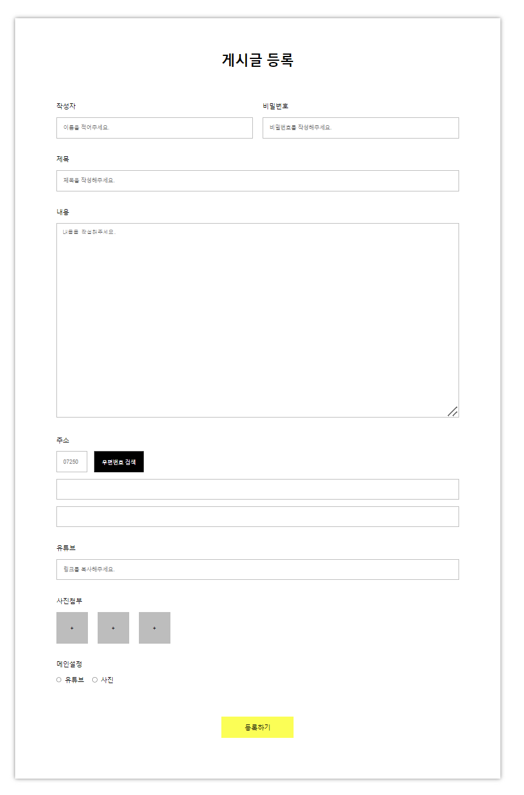
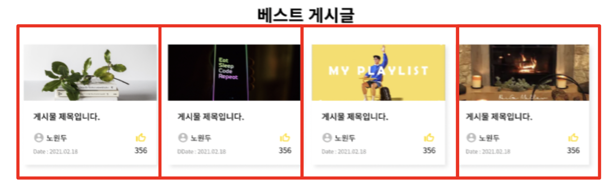
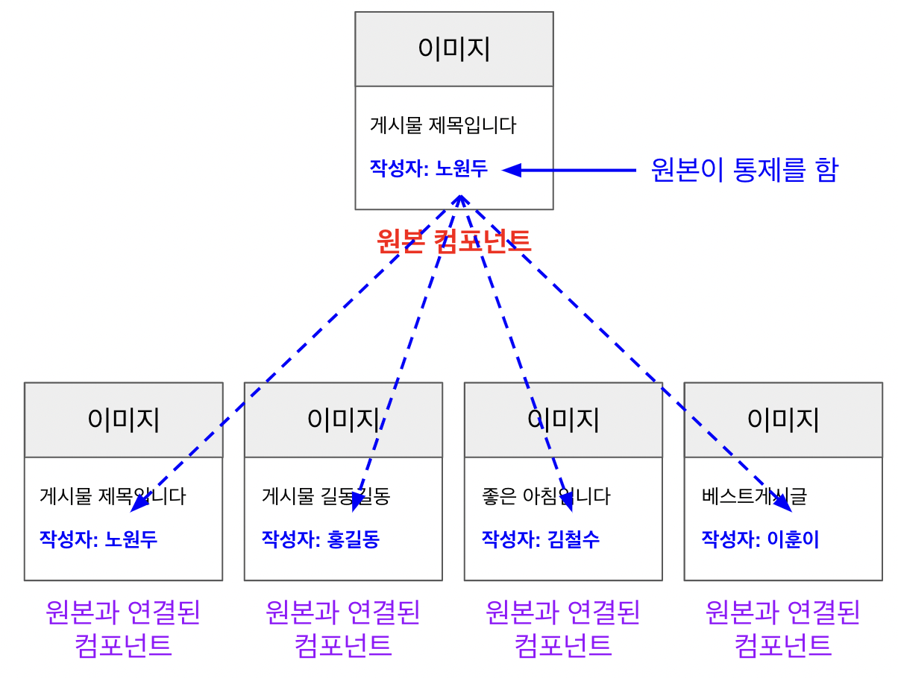
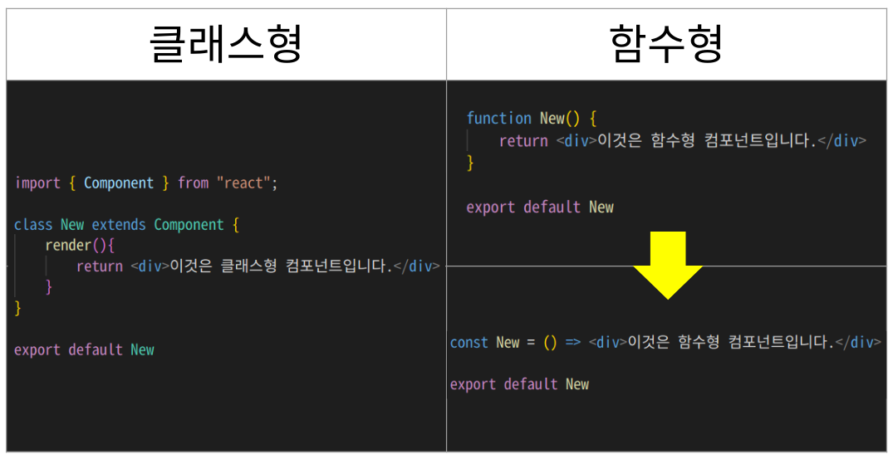

<h1>JSX와 CSS-IN-JS</h1>

<h3>React의 HTML(JSX)</h3>

React에서 사용하는 **`React 전용 HTML`** 이다.

React에서는 HTML 대신 JSX(React 전용 HTML)를 사용한다.

속성값의 대소문자 정도 차이 등을 제외하곤 거의 유사하다.

>💡**웹 브라우저는 HTML, CSS, JAVASCRIPT만 읽을 수 있지 않나?** 
그렇다. 우리는 React에서 사용하도록 만들어진 HTML인 JSX를 코딩합니다.
하지만, **`최종적으로 소스코드가 실행될 때는 JSX가 HTML로 자동으로 변환되어 실행`** 된다!

---

<h3>React의 CSS(CSS-IN-JS) - emotion</h3>

**`CSS-IN-JS`** 는 **`CSS를 JS상수에 저장해서 사용하는 방법`** 이다.

아래 그림 오른쪽은 동일한 CSS를 Title이란 상수에 저장한 것.

**`CSS-IN-JS 실습 예제(코드 부분 발췌)`**

~~~javascript
import styled from "@emotion/styled";

export const Wrapper = styled.div`
  width: 1200px;
  /* height: 1847px; */
  border: 1px solid black;
  margin: 100px;
  padding-top: 80px;
  padding-bottom: 100px;
  padding-left: 102px;
  padding-right: 102px;
  display: flex;
  flex-direction: column;
  align-items: center;
  border: none;
  box-shadow: 0px 0px 10px gray;
`;
~~~

~~~javascript
import {
    Address,
    ButtonWrapper,
    Contents,
    ImageWrapper,
    InputWrapper,
    Label,
    OptionWrapper,
    Password,
    RadioButton,
    RadioLabel,
    SearchButton,
    Subject,
    SubmitButton,
    Title,
    UploadButton,
    Wrapper,
    Writer,
    WriterWrapper,
    Youtube,
    Zipcode,
    ZipcodeWrapper
  } from "../../../styles/01_index";
  
  export default function BoardsNewPage() {
    return (
      <Wrapper>
        <Title>게시글 등록</Title>
        <WriterWrapper>
          <InputWrapper>
            <Label>작성자</Label>
            <Writer type="text" placeholder="이름을 적어주세요." />
          </InputWrapper>
          <InputWrapper>
            <Label>비밀번호</Label>
            <Password type="password" placeholder="비밀번호를 작성해주세요." />
          </InputWrapper>
        </WriterWrapper>
~~~

**`결과물`**

---

<h1>React 컴포넌트</h1>

`컴포넌트`란 UI 또는 기능을 **부품화해서 재사용 가능하게 하는 것**이다.

아래 그림과 같이, **동일한 UI를 재활용하고, 안에 데이터와 이미지만 바꿔줄 수 있음.**

> **컴포넌트는 복사/붙여넣기 방식인가?**
 복사/붙여넣기는 만약 여러 개의 복사본이 있고, **데이터를 일괄 수정하고 싶다면 하나하나 모두 수정해야한다**. 하지만, **컴포넌트는 원본 하나를 만들어서 뿌려주는 개념**이다. 
따라서, **원본만 변경하면 모두 적용됨**

---

<h1>클래스형 컴포넌트 vs 함수형 컴포넌트</h1>

React에서 `컴포넌트 작성 방법은 2가지`가 있다.

함수형은 **화살표 함수로도 표현이 가능**하다! 

React는 처음에 클래스형 방법만 존재했는데, 클래스형은 어렵고, 복잡하여 이후에 함수형 컴포넌트 방법이 추가되었다. 
최근에는 많은 기업이 `함수형 컴포넌트를 주로 사용`하지만, **기존에 이미 만들어진 서비스들은 클래스형으로 되어있는 경우도 많으므로**, `클래스형도 알아둘 필요`가 있습니다. 

---

<h1>React-Hooks</h1>

함수형 컴포넌트가 클래스형 컴포넌트보다 훨씬 간단하다.

하지만, 함수형 컴포넌트 그 자체만으로는 클래스형 컴포넌트의 모든 기능을 흉내낼 수 없다는 한계점이 존재한다.

그래서 React 에서 `함수형 컴포넌트에서도 클래스형 컴포넌트와 동일한 기능을 사용 가능하도록 도구를 만들어 주었습니다. 이 도구를 Hooks(훅) 이라고 부릅니다.`

대표적인 Hooks 에는 **`useState`**, **`useEffect`** 가 있습니다.
