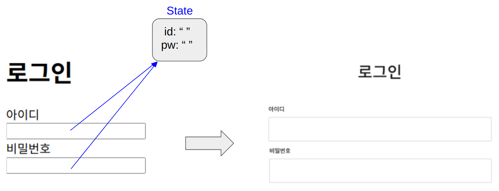
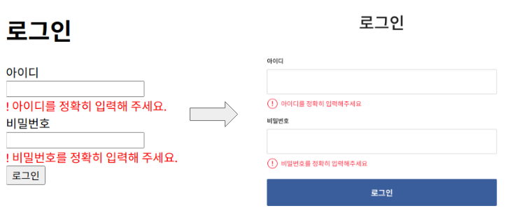

<h1>State(state, setState, useState)</h1> 

**`state란 리액트 컴포넌트에서 데이터를 담기 위한 상자`** 이다.

자바스크립트에서 데이터를 담기 위한 상자로 **`변수`** 를 사용한다.

다시 말해, **`state는 컴포넌트에서 사용하는 변수`** 입니다.

> **state**  
> * `state` 컴포넌트에서 사용하는 변수(state)
> * `setState`  컴포넌트에서 사용하는 변수(state)를 바꿔주는 기능
> * `useState` 컴포넌트에서 사용하는 변수(state)를 만들어주는 기능

---

<h1>State 생성 방법 및 구조</h1>

**(1)State변수 생성하기**
~~~javascript
// 자바스크립트에서 변수 만들기
// 변수만드는기능 변수명 = 담을내용           
let classmate = "철수"

// 리액트 컴포넌트에서 변수 만들기
// const [변수명] = 변수만드는기능(담을내용)
const [classmate] = useState("철수")
~~~

**(2)State변수 변경하기**
~~~javascript
// 자바스크립트에서 변수 바꾸기
let classmate = "철수"
classmate = "영희"
// classmate가 영희로 바뀝니다.

// 리액트 컴포넌트에서 변수 바꾸기
const [classmate, setClassmate] = useState("철수")
// classmate 가 영희로 바뀝니다.
setClassmate("영희")     
~~~

위 코드에서 알 수 있듯이, 리액트 컴포넌트에서 State 변수를 생성하고 변경하는 것은 아래와 같다. 

`const [변수명, 변수바꾸는기능] = 변수만드는기능(담을내용)`

---

<h1>리액트에서 let을 안쓰고 state를 변수로 사용하는 이유</h1>

**리액트 컴포넌트**는 **앞쪽에 화면에 보여지는 부분**(FrontEnd)과 **뒷쪽에 데이터를 관리하는 부분**(BackEnd)으로 나눌 수 있습니다.

만약, 단순히 `자바스크립트 변수 let(또는 상수 const) 를 사용`해서 좋아요를 화면에 그렸다면, 좋아요가 증가해서 17로 변경되었을 때, **`뒷쪽의 데이터 부분만 변경되고, 앞쪽 화면에는 반영이 되지 않는다.`**

화면에 반영 되길 원한다면, **`document.getElementById(”count”)innerText`** 를 이용해서 화면에 반영해야 한다.

하지만, **`컴포넌트 변수 state를 사용`** 해서 화면에 그리고, **`setState()를 사용해서 좋아요를 변경하면`**, **`setState() 안에서 화면을 새롭게 그리라는 명령이 실행`** 되어 변경된 데이터가 화면에 새로 그려지게 되는 것이다.

**예제코드**
~~~javascript
// let으로 count 예제 실험해보기(기존 방식)
function New() {
    let count = 0     
    // let으로 자바스크립트 변수 만들기
    
    function 팀() {
        count = count + 1     
        // 갯수는 증가했지만, 화면에는 반영이 안됨
    }

    return (
        

            <h1>{count}</h1>
            <button onClick={handleClick}>let을 사용하여 count 증가</button>
        

    )
}

// state로 count 예제 실험해보기
import { useState } from 'react'

function New() {
    const [count, setCount] = useState(0)     
    // state로 컴포넌트 변수 만들기
    
    function handleClick() {
        setCount(count + 1)     
        // 갯수가 증가하면서, 화면에 정상적으로 반영됨
    }

    return (
        

            <h1>{count}</h1>
            <button onClick={handleClick}>state를 사용하여 count 증가</button>
        

    )
}
~~~

**`요약`** 

state, setState, useState언제 사용하는가?
1) 회원가입, 게시물작성 내용 등을 `서버컴퓨터에 전송하기위해 변수에 담아둘 때 사용`합니다.

~~~javascript
function Login () {
    const [id, setId] = useState('')
    const [pw, setPw] = useState('')

    function handleChangeId(event) {
        const value = event.target.value
        setId(value)
    }

    function handleChangePw(event) {
        const value = event.target.value
        setPw(value)
    }

    return (
        

            <h1>로그인</h1>
            
아이디 {id}

            <input type="text" onChange={handleChangeId}/>
            
비밀번호 {pw}

            <input type="text" onChange={handleChangePw}/>
        

    )
}
~~~
2) 작성한 내용을 검증하고 `잘못된 부분을 빨간색으로 표기할 때 사용`합니다.

~~~javascript
function Login () {
    const [id, setId] = useState('')
    const [pw, setPw] = useState('')
		const [errorId, setErrorId] = useState('')
    const [errorPw, setErrorPw] = useState('')

    function handleChangeId(event) {
        const value = event.target.value
        setId(value)
    }

    function handleChangePw(event) {
        const value = event.target.value
        setPw(value)
    }

		function handleClickLogin() {
        if(id === "") {
            setErrorId('! 아이디를 정확히 입력해 주세요.')
        }
        if(pw === "") {
            setErrorPw('! 비밀번호를 정확히 입력해 주세요.')
        }
        if(id !== "" && pw !== ""){
            alert('아이디와 비밀번호가 모두 입력되었습니다. 로그인을 시작합니다.')
        }
    }

    return (
        

            <h1>로그인</h1>
            
아이디 {id}

            <input type="text" onChange={handleChangeId}/>
						
{errorId}

            
비밀번호 {pw}

            <input type="text" onChange={handleChangePw}/>
						
{errorPw}

						

                <button onClick={handleClickLogin}>로그인</button>
            

        

    )
}
~~~

**`참고하기❗️`** 
자바스크립트의 **`event`** 는 여러분들이 어떤 행위를 했는가를 알려주는 것.  
**`evevt.target`** 은 행위가 적용된 대상 즉, 태그를 의미함.  
그리고  **`event.target.value`** 는 작동된 태그에 입력된 값을 의미한다.

---
