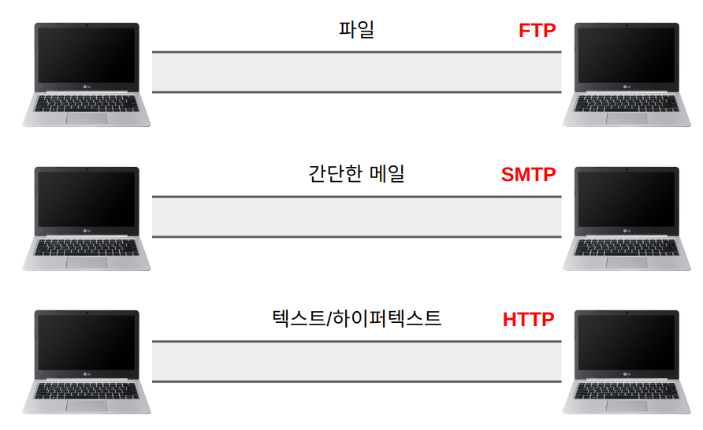
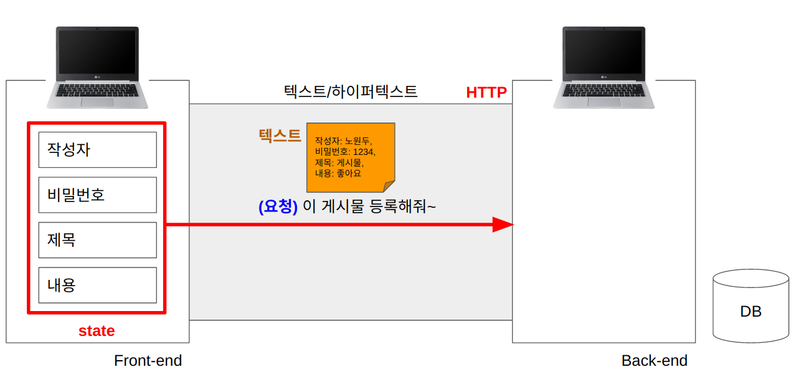
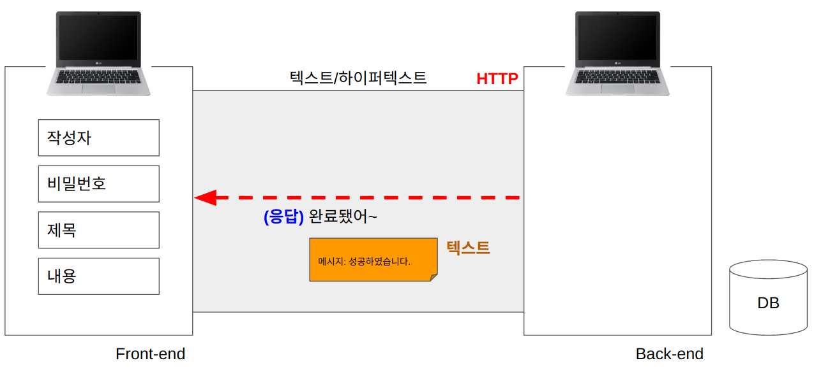
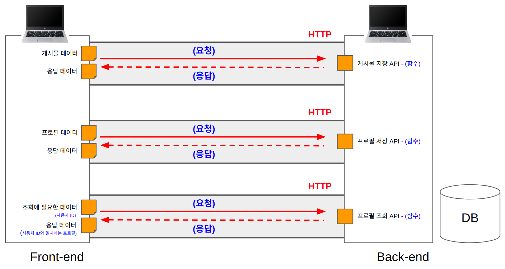
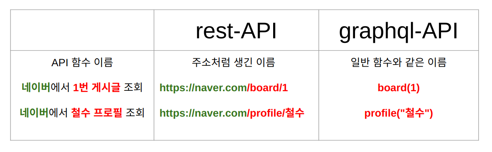
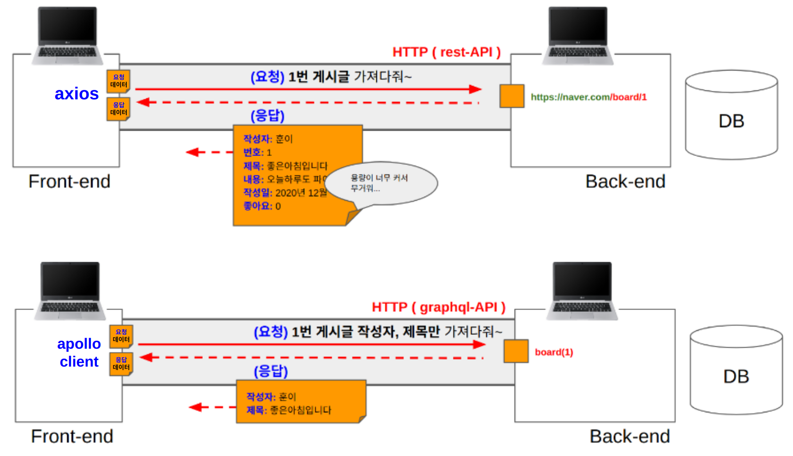
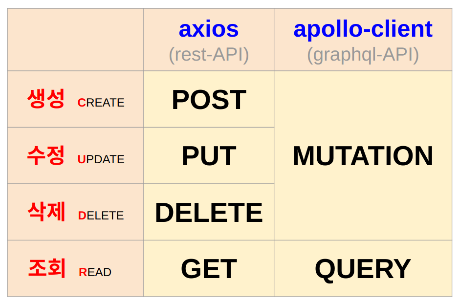
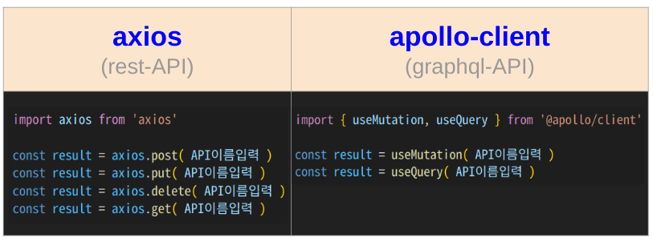
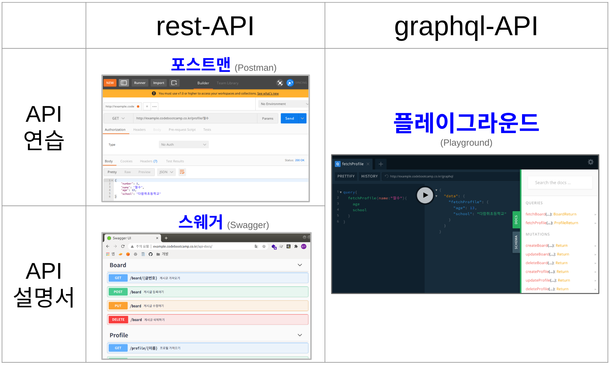

<h1>HTTP 통신</h1>

`HTTP`란 **두 컴퓨터간에 텍스트 데이터를 주고 받는 길**입니다.



`HTTP 라는 길`로  **요청(request)** 과 **응답(response)** 2가지를 서로 주고 받을 수 있습니다.

<h3>HTTP 요청(Request)와 응답(Response)</h3>

* `HTTP 요청(Request)`

   작성한 게시물 **텍스트 데이터를 HTTP를 통해 Back-end 컴퓨터로 보내고 Back-end 컴퓨터에게 이 데이터를 데이터베이스에 저장 해달라고 요청**합니다.


* `HTTP 응답(Response)`

    요청을 받은 Back-end 컴퓨터가 성공, 실패 등 **처리 결과를 응답**합니다.


Q. **바로 데이터 베이스에 요청하면 안되는가?**

A. 보안 및 데이터 정제 등의 이유로 Back-end에서 `검증 과정을 거쳐야 하기 때문에`, 아무나 함부로 데이터베이스에 요청할 수 없다.

> **참고하기**<BR>
Back-end 컴퓨터는 응답할 때, `응답 상태코드 라는 것도 함께 보내줍니다.`<br>
응답 상태코드는 100~ 599까지의 숫자로 구성되어 있습니다.<br>
자주 볼 수 있는 응답 상태코드는 `성공(200), Front-end 에러(400), Back-end 에러(500)` 등이 있습니다.<br>
예를들면, 요청에 성공하였으면 성공 메시지와  응답 상태코드 200을 함께 보내줍니다.

---

<h1>API</h1>

**API**란 **HTTP 요청을 Back-end 컴퓨터에 보냈을때 실행** 되는 `Back-end 기능`입니다.

예를 들어,
Front-end에서 HTTP라는 길을 통해서 게시물 데이터를 Back-end에 보내 저장시켰다.

만약, 게시물이 아닌 프로필 데이터를 저장하고 싶으면 어떻게 해야 할까?

그러기 위해선, **`여러개의 HTTP 라는 길이 존재`** 해야 하고, 각각의 요청마다 담당자가 필요하다.

우리는 이 담당자를 **`API`** 라고 부른다.



위 그림과 같이, **`게시물 데이터 저장을 해달라는 요청`** 이 들어왔을 때는 백엔드 개발자가 구현해놓은 **`게시물 저장API`** 가 작동되는 것이고, **`프로필 데이터 저장`** 을 해달라는 요청이 들어왔을 때는 **`프로필 저장 API`** 가 작동하게 되는 것이다.

Q. **API가 기능 이라고 했는데, 기능은 함수 아닌가?**

A. **그렇다. Back-end 개발자가 만든 함수**이다.<br> 함수는 인자와 return 데이터가 있다<br>
**API에 요청할 때 보내는 데이터**는 **`API 함수로 들어갈 인자`** 이고, **응답으로 받게되는 데이터**가 **`API 함수의 return 데이터`** 입니다.

---

<h1>API 종류(rest-API vs graphql-API)</h1>

API의 종류는 크게 **`rest-API`**, **`graphql-API`** 로 2가지가 있습니다.

**rest-API**와 **graphql-API** 는 몇가지 차이점이 있습니다.

<h3 style="color:skyblue">rest-API와 graphql의 차이점</h3>

rest-API는 **`API 이름이 마치 홈페이지 주소`** 처럼 생겼습니다.

graphql-API는 **`API 이름이 일반적인 함수`** 와 같습니다.


또한, 응답 결과물에 있어서의 차이가 존재합니다.

**`rest-API`** 는 응답 결과로 back-end 개발자가 만든 함수에서 보내주는 `모든 데이터`를 받아야만 합니다.

반면에, **`graphql-API`** 는 back-end 개발자가 만든 함수에서 **`필요한 데이터만`** 골라 받을 수 있습니다.

이러한 이유로, 각 API에 전송을 요청하는 담당자도 다릅니다.

`rest-API` 에 요청하는 요청담당자는 `axios` 입니다.

`graphql-API` 에 요청하는 요청담당자는 `apollo-client` 입니다.

**요청담당자**는 **Front-end 에서 설치하는 라이브러리입니다.**


위 그림처럼, `graphql`은 필요한 데이터만 골라 받을 수 있는 장점이 있어서, `효율적인 통신`을 할 수 있습니다.

>**graphql?**<br>
`graphql`은` 페이스북에서 발생하는 수많은 데이터를 처리하기 위해 `페이스북 개발팀에서 만들었으며,
`facebook, airbnb, github` 등 유명한 사이트에서 사용중인 통신 방법입니다.

<h1>API 응답 데이터 JSON ( JavaScript Object Notation )</h1>

이전 학습에서 JSON이라는 데이터 형식을 공부한 적이 있다.

## JSON이란?

**백엔드에서 응답을 받을 때, 객체 자체를 주고 받을 수 없습니다.**

따라서 객체를 문자열로 묶어서 객체를 담은 문자열을 보내게 되는데, **`객체를 담은 문자열을 객체 표기법`** 이라고 합니다.

즉, **백엔드에서 응답의 결과물로 넘겨주는 것이 JSON이고, JSON은 객체를 담은 문자열** 정도로 생각하시면됩니다.

받아온 **`JSON 데이터는 프론트에서 문자열을 벗겨 객체로 사용`** 하게 됩니다.

## JSON의 특징과 응답헤더

응답으로 주고받은 **JSON은 응답의 body 부분**입니다.

응답에는 header와 body부분으로 나뉘는데 body에는 JSON이 들어간다

그렇다면 header에는 어떤게 들어갈까?

**header**에는 **body와 관련된 요약정보**가 들어가게 됩니다.

**요약정보**라 함은 `응답을 보내는 사이트가 어디인지, 바디의 형태는 JSON인지 등등을 포함`하고 있습니다.

<h1>API와 CRUD</h1>

API는 크게 4가지 방식으로 구분할 수 있습니다.

1. 새로운 것을 **`생성하는 API`**    ⇒   **C**REATE
2. 기존의 것을 **`조회하는 API`**    ⇒   **R**EAD
3. 기존의 것을 **`수정하는 API`**    ⇒   **U**PDATE
4. 기존의 것을 **`삭제하는 API`**    ⇒   **D**ELETE




`실제 사용은 아래 그림과 같음`



# API 명세서

`API 명세서`는 `API 사용 설명서`입니다.

홈페이지를 만들기 전, Back-end 개발자가 만들어 놓은 `API 가 몇 개 있고, 어떻게 구성되어있는지 확인`하기 위해 필요.

**`API명세서는 Back-end 개발자에게 받는 것.`** Back-end 개발자는 자신이 만든 API를 직접 문서 형태로 작성하거나, **swagger** 라는 프로그램을 설치해서 만듭니다.



---

<h1 style="background-color:powderblue;color:yellow">grqphql API 사용 연습하기(with playground)</h1>

1) `createBoard를 활용해, 게시물을 하나 등록해 주세요.`<br>
```javascript
mutation {
  createBoard(
createBoardInput: {writer:"KDH", password:"1234", title:
"첫번째 게시물", contents:"KDH내용입니다."}
  ){
    _id
    writer
    title
    contents
    likeCount
    dislikeCount
  }
}
```
2) `등록한 게시글의 제목과 내용은 무엇인가요?`
```javascript
query {
  fetchBoard(boardId:"65c4b5a2bfc0f900299a8ef0"){
    title
    contents
  }
}
```
3) `등록한 게시글에 좋아요를 1 올려주세요.`
```javascript
mutation {
  likeBoard(boardId:"65c4b5a2bfc0f900299a8ef0")
}
```

4) `등록한 게시글에 싫어요도 1 올려주세요.`
```javascript
mutation {
  dislikeBoard(boardId:"65c4b5a2bfc0f900299a8ef0")
}
```

5) `등록한 게시글의 좋아요와 싫어요는 각각 몇 개 인가요? (fetchBoard를 활용해서 확인해 보세요.)`
```javascript
query {
  fetchBoard(boardId:"65c4b5a2bfc0f900299a8ef0"){
    likeCount
    dislikeCount
  }
}
```
6) `현재 등록된 게시글의 총 갯수는 몇 개 인가요? (어떤 API를 활용하면 좋을지 찾아보세요!)`
```javascript
query {
  fetchBoardsCount
}
```
7) `등록한 게시글의 제목을 수정해 보세요!`
```javascript
mutation {
	updateBoard(boardId:"65c4b5a2bfc0f900299a8ef0", password:"1234", updateBoardInput:{
    title:"제목 수정했습니다."
  }){
    writer
    title
    contents
  }
}
```
8) `fetchBoards 전체 게시물 조회를 활용하여 방금 쓴 게시물을 검색해 보세요.(search 변수를 활용해요!)`
```javascript
query{
  fetchBoards(search:"제목 수정했습니다."){
    writer
    title
  }
}
```
9) `등록한 게시글에 댓글을 3개 추가해 보세요.`
```javascript
mutation {
  createBoardComment(boardId:"65c4b5a2bfc0f900299a8ef0",
    createBoardCommentInput:{
      writer:"KDH"
      password:"1234"
    	contents:"댓글 3번째!"
      rating:1.5
    }){
     _id
    writer
    contents
    createdAt
    }
}
```
10) `첫번째 댓글의 내용을 수정해 보세요!`
1. **첫 번째 댓글 id 확인**
```javascript
query {
  fetchBoardComments(page:1, boardId:"65c4b5a2bfc0f900299a8ef0"){
    _id
    contents
  }
}
```
2. **수정하기**
```javascript
mutation{
  updateBoardComment(
    updateBoardCommentInput:{
      contents:"첫 번째 댓글 수정하겠습니다."
    }
    boardCommentId:"65c4e759bfc0f900299a8ef1",
    password:"1234"){
    _id
    writer
    contents
    createdAt
    updatedAt 
  }
}
```
11) `두번째 댓글을 삭제해 보세요!`
**10번과 마찬가지로, 2번째 게시물 id 조회 후 수정**
```javascript
mutation{
  updateBoardComment(
    updateBoardCommentInput:{
      contents:"두 번째 댓글 수정하겠습니다."
    }
    boardCommentId:"65c4e759bfc0f900299a8ef2",
    password:"1234"){
    _id
    writer
    contents
    createdAt
    updatedAt
  }
}
```
12) `등록한 게시글에 달려있는 모든 댓글을 조회해 보세요.(작성자와 내용만 조회합니다.)`
```javascript
query {
  fetchBoardComments(page:1, boardId:"65c4b5a2bfc0f900299a8ef0"){
    _id
    contents
  }
}
```
13) `BEST게시글을 조회해 보세요! (API 이름을 잘 찾아보세요!)`
```javascript
query {
  fetchBoardsOfTheBest{
    _id
    writer
    title
    contents
    likeCount
    dislikeCount
    createdAt
  }
}
```
14) `회원가입을 해보세요! 사용자, 즉 User를 만드는 API입니다!`
```javascript
mutation {
  createUser(createUserInput:{
    email:"naver@naver.com", password:"1234",name:"kdh"}
  ){
    _id
    email
    name
    createdAt
  }
}
```