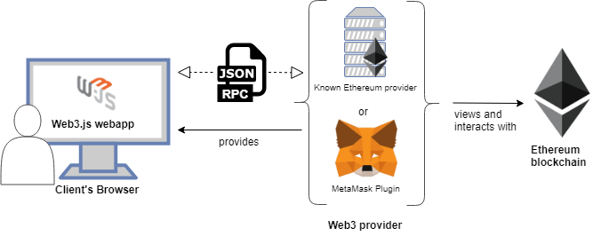

<h1>2024.01.07(일)</h1>

<ul>

<li>

**다양한 통신 프로토콜들💻** 
<li>

**🟡Web3.js란 무엇인가?**

<li>

**🟢블록체인(Block Chain) 통신 과정**

<li>

**🔵Web3.js의 기능**
</ul>

<h2>다양한 통신 프로토콜들💻</h2>

**HTTP** 
가장 흔한 웹 통신 프로토콜 
<u>웹 브라우저와 웹 서버 간에 데이터를 전송하는 데 사용</u>된다. 
**웹3.js가 이더리움 노드와 통신하기 위한 일반적인 방법 중 하나**

**WebSocket** 
**양방향 통신**을 제공하는 네트워크 프로토콜 
HTTP와 달리 WebSocket은 지속적인 연결을 통해 데이터를 양방향으로 주고받을 수 있다. 
**웹3.js가 원격 이더리움 노드와 실시간으로 상호 작용할 때 WebSocket을 사용** 
C:문열어주세요~(Request)  S:네 열어드릴게요(Hand Shake)
 
><strong>IPC(Inter-Process-Communication)?</strong> 
같은 시스템 내에서 프로세스 간에 통신하기 위한 메커니즘.  
로컬 머신의 여러 프로세스가 서로 통신할 수 있다. 
>**웹3.js가 이더리움 노드와 로컬에서 통신할 때 IPC를 사용**

<h2>🟡Web3.js란 무엇인가?</h2>

HTTP, IPC 또는 WebSocket을 사용하여 **로컬 또는 원격 이더리움 노드와 상호 작용할 수 있게 해주는 라이브러리 모음**입니다.

쉽게 말해, **이더리움 블록체인 기반 DApp**을 만들고 싶고, 그러려면 **로컬 또는 원격 이더리움 노드와 소통할 수 있도록 해야됨**. 
**Web3.js**는 이를 도와주는 **JavaScript 라이브러리 중 하나**로, **다양한 기능과 API**를 제공

---

<h2>🟢블록체인(Block Chain) 통신 과정</h2>
 
<ul>
<li>

**Client Browser (클라이언트 브라우저)** 
클라이언트 브라우저에서 실행되는 DApp은 Ethereum 블록체인과 상호작용할 필요가 있습니다.
<li>

**Web3 Provider(web3 공급자)** 
클라이언트 브라우저에서 실행되는 **DApp과 Ethereum 블록체인 간의 중간 역할**을 합니다. 
가장 흔한 Web3 공급자 중 하나는 **MetaMask**입니다. MetaMask는 **브라우저 확장 프로그램**으로 **사용자의 개인 키를 안전하게 저장**하고 **Ethereum 네트워크에 연결해주는 역할**을 합니다.
<li>

**Ethereum Blockchain (이더리움 블록체인)** 
이더리움 블록체인은 **DApp의 스마트 계약과 거래를 처리하는 분산된 블록체인 네트워크**입니다. 

><strong style="background-color:powderblue;color:black;">스마트 계약(Smart Contract)?</strong>  블록체인에 배포되어 분산 네트워크에서 동작하며, 코드에 의해 자동으로 실행되므로 **중간 담당자 없이 프로그램이 실행되는 특성**을 가지고 있습니다. 
예를 들면 **디지털 자산 교환**, **투표 시스템**, **게임의 규칙 실행** 등 다양한 분야에서 활용될 수 있습니다.  
<li>

<strong>web3.js</strong> 

web3.js는 JavaScript 라이브러리로, **클라이언트 브라우저에서 이더리움 블록체인과 상호작용할 수 있도록**도와줍니다.

**클라이언트 브라우저에서 DApp이 web3.js를 사용하면, 이더리움 블록체인과의 상호작용을 담당하는 객체를 생성하고 제공**합니다.

---

<h2>🔵Web3.js의 기능</h2>

<strong style="background-color:skyblue;color:black">web3.js를 사용하면 DApp은</strong>  **1.새로운 스마트 계약을 Ethereum 블록체인에 배포**  
**배포하려는 스마트 계약을 컴파일**하고, **그 결과를 이용하여 블록체인에 배포**  
 **2.배포된 스마트 계약의 메서드를 호출하여 상호작용할 수 있습니다. 이를 통해 스마트 계약이 정의한 기능을 실행하고 블록체인에 상태를 변경할 수 있습니다.**  
 **3.Ethereum 블록체인에서 데이터를 읽고 쓸 수 있습니다.** 이는 특정 블록의 정보 조회, 계정 잔액 확인, 트랜잭션 전송 등과 같은 작업을 포함합니다.

---

><strong>JSON-RPC는 무엇인가?</strong> 
JSON-RPC(JavaScript Object Notation Remote Procedure Call)는 **원격 프로시저 호출을 위한 경량의 프로토콜** 

이는 **클라이언트와 서버 간의 통신을 간소화하기 위해 JSON을 사용**하며, 주로 **웹 애플리케이션에서 API를 호출**하거나 **원격 프로시저를 실행할 때 사용**됨

JSON-RPC는 **데이터를 JSON 형식으로 전송**합니다. 이는 **사람이 읽기 쉽고 기계가 파싱하기 쉬운 구조**를 가지고 있습니다.

---
<h2>Plan🔥</h2>

**1.Web3.js 라이브러리 직접 사용해보기**

**2.비동기 프로그래밍 복습**

**3.알고리즘 공부 계획 세우기(언어,공부방법 등)**