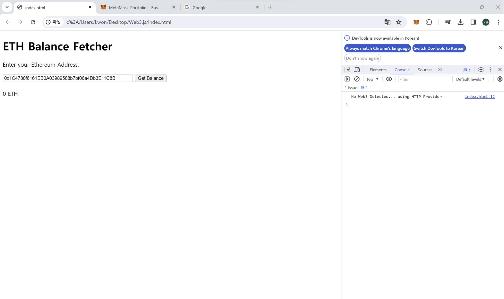

<h1>2024.01.10(수) - Web3.js</h1>

<h2>🔵Geth, Infura</h2>

**Geth는 Go etherium**이다.  
직접 블록체인 노드를 실행 가능 But, 이더리움 블록체인에서 Geth를 실행하면 주변에 있는 피어들과 동기화를 진행하고, 블록체인 사본을 다운로드 받기 시작함.  **-> 용량,비용多** 

이것을 해결하기 위해 등장한 것이 **Infura**이다.  
원격 이더리움 노드에 접근할 수 있도록 **엔드포인트**를 제공한다. 
개발자는 이더리움 블록체인에서 노드를 직접 구동하고 관리하지 않아도 **블록체인에 접근 & JSON-RPC로 통신**
> <strong>엔드포인트란?</strong> 
서버가 특정 리소스에 접근하기 위한 **주소 또는 URL**을 의미한다. 
이더리움에서는 엔드포인트가 **주로 JSON-RPC서버**를 나타냄.
**엔드포인트를 통해 노드와 통신**함.

<h2>🔴MetaMask</h2>

**MetaMask**는 웹 브라우저에서 **DApp(분산 어플리케이션)을 사용하기 위한 클라이언트로 사용**되는 것. 사용자가 웹 브라우저에서 MetaMask를 활성화하면, MetaMask는 사용자의 **브라우저에 이더리움 지갑을 제공**하고, 사용자가 DApp에서 **암호화폐 트랜잭션을 수행하거나 스마트 컨트랙트와 상호작용할 수 있도록** 한다.

---

<h2>🟡Web3.js 이용한 잔액 조회</h2>

~~~javascript
    
    
~~~ 

위 코드를 설명하자면, 브라우저가 load되면 첫 번째로 web3가 정의되어 있는 지 확인한다. 그러나, 우리는 infura에서 제공하는 테스트넷 엔드포인트로 연결해야하므로, else문으로 빠지게 된다.  

> <strong>메인넷(Main net)과 테스트넷(Test net)</STRONG>  
>>메인넷(Main net)
>* 실제로 사용되는 블록체인 네트워크
>* 실제 거래가 발생하고, 실제 자산(암호화폐 등)이 전송되는 환경
>* 메인넷에서 발생한 거래는 영구적으로 기록되며, 해당 블록체인의 현실 세계에서의 상태를 반영
>>테스트넷(Test net)
>* 테스트넷은 메인넷과 유사한 환경을 모방한 테스트용 블록체인 네트워크
>* 개발자들이 스마트 계약, 앱, 또는 다른 블록체인 관련 기능을 안전하게 테스트할 수 있는 환경을 제공
>* 테스트넷에서 사용되는 토큰은 실제 가치가 없고, 무료로 얻을 수 있는 경우가 많습니다.

**web3.eth.getBalance** 메서드를 사용하게 되는데, 이는 **잔액을 반환하는 메서드**임. 
콜백함수를 이용해서 만약 getBalance를 성공한다면, 반환값을 Wei단위에서 ether 단위로 변환 후 balance에 저장한다.

</img>
---

처음에는 정말 알고있는 개념이 없어서 이해하기가 너무 힘들었는데, 반복적으로 조사하면서 공부하다보니 네트워크 통신 체계와 이더리움 블록체인에 대한 지식이 조금씩 쌓이는 것 같아서 뿌듯하다. 