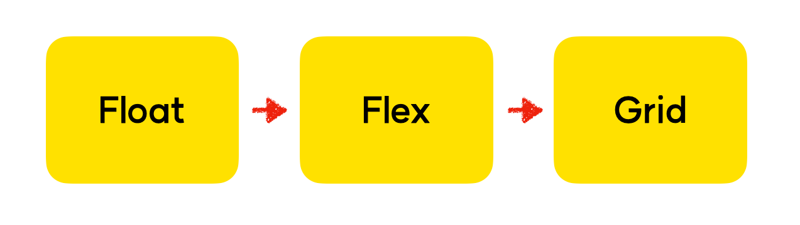

<h1 style="background-color:#FBF3DB;color:black;border:none;width:50%">가상 클래스 선택자</h1>

실제로 HTML 요소를 수정하지 않고,
**CSS만으로 가상 요소를 추가해서 선택할 수 있다** 

~~~
선택자:가상클래스 {
	property:value
}
~~~

Ex)
만약 **box1클래스 안에 p태그가 7개 들어있는 상황**이라면 
~~~
.box1 p:first-child {
	background-color : red;
}
~~~
**box1클래스 안에 있는 p태그들 중 첫 번째를 선택하라**는 의미가 됨. 
**last-child**하면 가장 **마지막을 선택**함. 

**그 외에, 몇 번째 요소를 선택할 지 선택**가능 
**nth-child(n)** -> 소괄호 안에 몇번째 선택할지 입력  "nth-child"는 고정이고, 소괄호 안에는 연산식도 가능.  짝수번째만 선택해라 ! => **nth-child(2n)**

**hover 가상 클래스** 
마우스오버, 롤오버 => **마우스가 올라갔을 때 발동되는** 일종의 전환효과 혹은 이벤트를 의미 
Ex) 
~~~
//button1 요소에 마우스가 올라가면 색깔 변화
.button1:hover {
	background: red;
	color:#ffffff;
} 
~~~
이 외에도 수많은 가상 클래스 선택자가 존재한다. 

---

<h1 style="background-color:#FBF3DB;color:black;border:none;width:72%">CSS레이아웃 시스템의 변화</h1>

 

**과거에는 float를 사용**해서 레이아웃을 구성했다.

**이후에 flex가 등장**하며 flex를 보편적으로 사용하게 되었고 점차 float를 사용하지 않게됨.

**마지막으로 제일 나중에 grid가 등장**하였으며, 현대 웹에서는 **flex와 grid를 혼용**하는 추세.

**flex가 적합한 곳에는 flex를 grid가 적합한 곳에는 grid**를 선택해서 사용하면 효율적으로 레이아웃을 구성

---

<h1 style="background-color:#FBF3DB;color:black;border:none;width:34%">Float Layout</h1>

**전통적으로** 레이아웃을 구성할때 사용하던 방법임,

하지만 float 레이아웃은 **PC로만 인터넷에 접속할 수 있던 시절에 고안**되었기 때문에,
**반응형 웹에는 적합하지 않다**.

> ❗️ **반응형 웹이란?** 
모바일, 태블릿, 데스크탑 PC 등 **접속하는 기기의 너비에 맞추어** 레이아웃이 변하는 웹페이지

## **float**

HTML 요소를 일반적인 흐름(normal flow)으로부터 벗어나서 특정한 컨테이너의 좌측 혹은 우측을 감싸는 형태로 강제 배치할 수 있도록 도와주는 속성.

- **float: none (기본값)**
- **float: left**
- **float: right**

## **clear**

float가 적용된 요소에 추가로 줄 수 있는 속성으로, float의 영향력을 해당 요소에 한해 해제함.

- **clear: none (기본값)**
- **clear: left**
- **clear: right**
- **clear: both**

