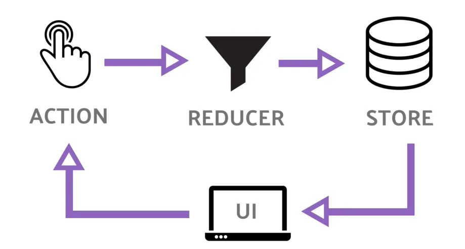

# 리덕스(Redux)

**사용하는 이유** 
React에서 State는 컴포넌트 안에서 관리된다. 자식 컴포넌트들끼리 상태롤 공유하고 싶을 때는 **무조건 부모 컴포넌트**를 거쳐야 함. 
만약, 자식이 많아지면 상태 관리가 매우 복잡해진다. 
**-> props drilling issue**

Redux를 사용하면 컴포넌트 바깥에서 상태를 관리할 수 있다.

## 리덕스 흐름

**Store**
* 상태가 관리되는 공간
* 컴포넌트에서 스토어에 접근하여 상태 정보를 얻음

**Action**
* 스토어에 전송할 데이터(주문서)
* 자바스크립트 객체 형식

**Reducer**
* 새로운 store를 생성한다.
* 액션->스토어 불가!!
* 액션->리듀서->스토어
* 리듀서에 전달하기 위해서 **dispatch()** 메소드를 사용

## 컴포넌트의 스토어 subscribe(listener)

G 컴포넌트는 스토어에 구독을 한다. 구독을 하는 과정에서, 특정 함수가 스토어한테 전달이 된다. 그리고 나중에 **스토어의 상태값에 변동이 생긴다면 전달 받았던 함수를 호출**해준다.

